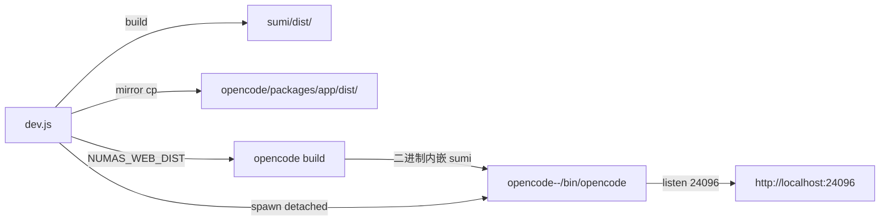

# Numas — 牛马

> **Numas (🐮 牛马 AI)** — 打工人首选工作模式。
> 一个本地一体化 AI IDE, 一行命令拉起, 对标腾讯 workbuddy。

---

## 1. 这是什么

Numas = **sumi (codeblitz/opensumi 容器 + React) 客户端** + **opencode (本地 fork) 后端** 二合一。

- 纯本地, 浏览器打开就用, 跨平台 mac / linux / win
- AI 助手 / 资源管理器 / 终端 / PDF 阅读标注 / HTML 渲染 / Paper 试卷库 全内置
- 单一端口 (默认 24096)

### 设计原则

- **砍中间层**: 客户端直连 opencode (HTTP/WS/SSE), 无服务端代理
- **集成打包**: opencode 二进制内嵌 sumi dist, 启动即一体
- **DI 解耦**: 业务只依赖接口 Token (commands/), 替换实现 / 写测试都简单
- **vsix 拓展**: 独立打包, registry @ 7790 分发

---

## 2. 快速开始

### 用户 (推荐)

```bash
npx -y github:weizuxiao911/numas
```

启动后浏览器自动打开 http://localhost:24096.

### 开发者

```bash
git clone https://github.com/weizuxiao911/numas
cd numas
npm install
npm run dev        # = node dev.js
```

### 前置

| 项 | 要求 | 说明 |
|---|---|---|
| Node | ≥ 20 (LTS 推荐) | dev.js 启动强校验, < 20 直接报错退出 |
| bun | 自动 | `opencode build` 依赖 (dev.js 启动时自检) |
| 端口 24096 | 空闲 | dev.js 启动前 `lsof -ti :24096` 清 zombie |

`npm install --ignore-scripts` 跳过 spdlog native postinstall (Python 3.14 删 distutils 后 node-gyp@9 必崩), opensumi 走 JS fallback logger, 主流程不受影响.

---

## 3. 命令行参数

```bash
npx -y github:weizuxiao911/numas [flags]
```

| Flag / Env | 默认 | 说明 |
|---|---|---|
| `--port <n>` / `NUMAS_PORT` | 24096 | opencode web 端口 |
| `--registry <url>` / `NUMAS_REGISTRY` | http://127.0.0.1:7790 | vsix registry 地址 |
| `--fast` / `NUMAS_FAST=1` | off | 跳过 sumi build / cp dist / opencode build, 只杀 port + 启 opencode (复用场景 5-10s → 1-2s). 改了前端代码必须去掉 |
| `--force-build` | off | 强制重 build (sumi + opencode), 忽略 hash 缓存 |

示例:

```bash
# 改端口
npx -y github:weizuxiao911/numas --port 8080

# 快启 (不重 build)
npx -y github:weizuxiao911/numas --fast

# 自定义 registry
npx -y github:weizuxiao911/numas --registry http://192.168.1.10:7790
```

---

## 4. 架构

### 4.1 整体 (本地集成模式)

dev.js 编排: sumi deps 自检 → opencode binary 自检 → kill port → sumi build → mirror cp → opencode build (内嵌 sumi dist) → spawn `opencode web --port 24096`.



**进程树**: dev.js → opencode web (独立 detached 进程组, pgid=-pid). SIGINT 杀整组.

本地集成模式**只有一个**进程组 (opencode 自己 serve 内嵌的 sumi dist, 替换官方 UI).

### 4.2 客户端分层 (sumi/src)

按 DI 思想分层, 业务只依赖接口 Token.

| 层 | 目录 | 职责 |
|---|---|---|
| **commands** | `sumi/src/commands/` | 接口定义 (IFileSystem, IAgent, IRegistry, IEnvService) |
| **config** | `sumi/src/config/` | 容器配置 (app / brand / layout / modules / preferences / runtime / slots) |
| **service** | `sumi/src/service/` | 接口实现 (agent / env / fs / registry / terminal), 挂载 `window.__APP_FS__` / `__APP_OPENCODE__` |
| **extensions** | `sumi/src/extensions/` | 8 个内置 (actions / ask / chat / filepicker / opentype / pdf / welcome / workspace) |
| **patches** | `sumi/src/patches/` | main-thread 接管 webview 生命周期 (`patch-custom-editor.ts`) |
| **styles** | `sumi/src/styles/` | overrides.css (865 行) + slots.css (201 行) |

**铁律**: 所有拓展文件系统操作必须走 codeblitz + opencode fs API (`/api/fs/*`), 严禁直连 service 层. 直连易崩 + 路径分裂难维护.

### 4.3 opencode fork 增量

`opencode/` 是 numas 仓库内嵌的完整 fork (31 个 packages), 不是 npm 包也不是 submodule. fork 增量:

- `scriptName("numas")` (`packages/opencode/src/index.ts:47`) — 品牌替换
- CSP 全开放 (`server/shared/ui.ts:17-21`) — 给内嵌 opensumi 用
- `--registry` flag (`cli/network.ts:33-37`) → HTML 注入 `window.__APP_CONFIG__.registryBaseUrl` (`server/shared/ui.ts:71-77`)
- `control-plane/` (多工作区路由) + `effect/` (Effect-TS runtime)
- `event-v2-bridge.ts` + `event-manifest.ts` (V2 事件总线桥接)
- `/api/fs/*` 9 个端点 (read / list / find / stat / write / mkdir / remove / rename / watch, base64 write, 见 `protocol/src/groups/fs.ts`)
- `x-opencode-directory` header + `?directory=` query (per-request workspace 路由, `server/routes/instance/httpapi/middleware/workspace-routing.ts`)
- `@parcel/watcher` 服务端 fs watcher → `file.watcher.updated` SSE (200ms 防抖)
- `opencode/packages/opencode/src/cli/cmd/web.ts` — `web` 子命令 (instance: false, per-request workspace 路由, pre-warm + 1500ms 后自动开浏览器)

### 4.4 通信方式

| 用途 | 协议 | 入口 |
|---|---|---|
| 文件读 | HTTP `GET /api/fs/read/<path>` | `sumi/src/service/fs.ts:840` |
| 文件写 | HTTP `POST /api/fs/write` (base64) | `sumi/src/service/fs.ts:897` |
| 文件删 / 建 / 移 | HTTP `/api/fs/remove` / `/mkdir` / `/rename` | `service/fs.ts` |
| 终端 PTY | WS `${baseUrl}/pty/{id}/connect?directory=...` | `service/terminal.ts:325` |
| AI | SDK `@opencode-ai/sdk/v2/client`, header 自动带 `x-opencode-directory` | `service/agent.ts:184` |
| 事件 | `EventSource ${baseUrl}/global/event` (V1 SSE) | `service/fs.ts:711` |

### 4.5 内置拓展 (8 个)

| 拓展 | 能力 |
|---|---|
| **actions** | 顶栏 UI (品牌 / cwd 切换 / 主题切换 / 3 个布局 toggle) |
| **ask** | 通用 AI 通道 `ask(prompt, cb)` 单 EventSource + 多 session 派发 |
| **chat** | 主聊天面板, 多 session / model / agent 切换, cwd 切换, 附件上传 |
| **filepicker** | 通用 filepicker modal, 监听 `filepicker:request` 事件 |
| **opentype** | 重写 explorer 右键 "打开方式 / 配置默认编辑器" (覆盖 OpenSumi file-tree 3 个 bug) |
| **pdf** | 内置 PDF 阅读器 (rect 圈选 → AI ask popover → 批注演示动画) |
| **welcome** | 空工作区欢迎页 (`onDidRestoreState` 自动开) |
| **workspace** | 引导页 + WorkspacePicker (监听 `workspace:request-show`) |

注册入口: `sumi/src/config/modules.ts:7-39` (TerminalNextModule + TaskModule + AgentModule + RegistryModule + FileSystemModule + TerminalModule + EnvModule + ActionsModule + WelcomeModule + ChatModule + WorkspaceModule + FilePickerModule + PdfReaderModule + OpenTypeModule).

### 4.6 vsix 拓展 (registry 分发)

`extensions/` 三个独立 vsix 源码, **都不在 dev 模式加载**, 都走 registry 7790 分发:

| vsix | viewType | 能力 |
|---|---|---|
| `extensions/html/` | `htmlViewer` | HTML 预览/编辑 (iframe srcDoc), 双击 .html/.htm 命中 |
| `extensions/paper/` | `paperEditor` | 试卷/题库预览 (vite webview 渲染 .paper) |
| `extensions/pdf/` | `pdfViewer` | PDF 阅读 (vsix customEditor, PDF.js CDN) |

构建: 各自 `esbuild.config.mjs` → `dist/extension.js` → `scripts/package.js` 打 `.vsix`. registry `build.js` 扫描 `vsix/*.vsix` → adm-zip 解压 → `dist/<publisher>.<name>-<version>/` + 写 `metadata.json`.

**注意**: `extensions/pdf/` 跟 `sumi/src/extensions/pdf/` 是两套并行实现. 内置版 (sumi/src) dev 模式直接加载, vsix 版走 registry 部署.

---

## 5. 工作原理

### 5.1 文件系统

**读**: HTTP `GET /api/fs/read/<path>` (opencode server side 直接走真实磁盘), ~10ms.
**写**: HTTP `POST /api/fs/write` (base64 content), ~100ms+.
**事件**: opencode 服务端 `@parcel/watcher` (mac: fs-events / linux: inotify / win: windows native), 200ms 防抖 → 发出 `file.watcher.updated` SSE 事件 → 客户端解析后 `scheduleFsFire` (300ms 防抖) + hash 对比去重自己写.

**客户端零额外 watch 进程** — 不跑 watchexec / chokidar / fs.watch. 全部在 opencode 服务端.

### 5.2 BrowserFS 桥接

opensumi/codeblitz 通过 BrowserFS → `WriteSyncFS` (`sumi/src/config/runtime.ts:47`) → `getFileSystemService().write/rm/mkdirp/move` → `/api/fs/*`.

`WriteSyncFS._syncSync` 拦截墓碑日志:
- `/.browserfs_deletedFiles.log` (d 行 → 逐条 syncRm 宿主机)
- `/.browserfs_moves.log` (m 行 → 逐条 syncMove 宿主机)

日志只进 InMemory 不写宿主机 (避免 explorer 多出墓碑文件).

**postinstall** (`sumi/scripts/patch-codeblitz-constant.js`) 就地改 `node_modules/codeblitz`:
- `constant.js`: `WORKSPACE_ROOT` 取 `APP_CWD` → sessionStorage → `__APP_CONFIG__.cwd` → `/workspace`
- `disk-file-system.provider.js`: `fse.move` (fs-extra copy+remove 实现, 损坏 30MB+ 大文件) → 桥接 `window.__APP_FS__.move`

**postinstall** (`patch-opensumi-customeditors.js`) 接管 `customEditors.js` 用 useRef 版本, webview 生命周期由 `sumi/src/patches/patch-custom-editor.ts` 的 main-thread 接管.

### 5.3 工作目录切换全局影响

**来源优先级** (`sumi/src/service/env.ts`):
1. `localStorage.APP_CWD` (运行时切换) — 最高
2. `window.__APP_CONFIG__.cwd` (启动时固定) — 兜底

**全局影响**: opencode SDK header 自动带 `x-opencode-directory: encodeURI(cwd)` → 所有 SDK 调用 (file / AI / pty / event) 上下文跟随 → chat 文件引用 / 终端 cwd / 标注 sidecar 路径 全部跟随.

**CJK 路径**: HTTP header ISO-8859-1 限制, `x-opencode-directory` 必须 `encodeURI()` 包裹.

---

## 6. 文档索引

| 文档 | 内容 |
|---|---|
| [AGENTS.md](./AGENTS.md) | AI 协作铁律 (6 条) + 项目事实 + 约定/禁忌 |
| [docs/架构设计.md](./docs/架构设计.md) | 架构总览 + 6 张架构图 + 11 节 |
| [docs/功能清单.md](./docs/功能清单.md) | 已落地功能勾选清单 |
| [docs/文件系统设计与测试用例.md](./docs/文件系统设计与测试用例.md) | fs 设计 (DynamicRequest read + WriteSyncFS write + OverlayFS) + 验收 26 用例 |
| [docs/标注功能设计与测试用例.md](./docs/标注功能设计与测试用例.md) | PDF 标注设计 + AI ask popover + 批注演示 |

---

## 7. 已知限制

- **PDF 标注**: 跨页选区不支持, 不支持编辑已有标注, 无侧栏列表
- **PDF 缩放**: 5 档 (50 / 75 / 100 / 125 / 150)
- **多用户**: 不支持 (opencode 单实例, 无服务端)
- **历史持久化**: opencode SQLite (`~/.local/share/opencode/opencode.db`)
- **registry 7790**: 手动启, dev 模式不自动启
- **dev.js 装 watchexec**: 当前是 dead code, 客户端零额外 watch 进程, 全部在服务端. 待清理

---

## 8. 排错 FAQ

**Q: 启动后浏览器没自动打开?**
A: 系统 `open` / `xdg-open` 不可用 (headless server). 手动打开 http://localhost:24096.

**Q: 端口 24096 被占?**
A: `lsof -ti :24096 | xargs kill -9` 清 zombie, 或 `--port <n>` 改.

**Q: `npm install` 卡 spdlog 报错?**
A: Python 3.14 删 distutils 后 node-gyp@9 必崩. dev.js 已加 `--ignore-scripts` 跳过, opensumi 自动 fallback JS logger.

**Q: 改了前端代码但 UI 没变?**
A: 跑 `node dev.js --force-build` 强制 rebuild, 或去掉 `--fast`.

**Q: 重启很慢?**
A: 用 `--fast` 跳过 build/cp (前提: 上次 build 后没改 sumi/src/ 或 opencode 源码).

**Q: Node 版本 < 20?**
A: dev.js 启动即报错退出, 提示安装链接 https://nodejs.org.

**Q: npx 首次执行不提示确认?**
A: 加 `-y` 跳过 (`npx -y github:weizuxiao911/numas`). 缓存失败 `rm -rf ~/.npm/_npx`.

**Q: 文件系统 watcher 不响应?**
A: 检查 opencode 服务端 `@parcel/watcher` 是否启动 (mac: fs-events / linux: inotify / win: windows). 客户端只订阅 SSE, 自身不跑任何 watch 进程.

**Q: 中文路径 404?**
A: opencode SDK header 自动 `encodeURI` cwdHeader. 散落 fetch 必须用全局 SDK (`window.__APP_OPENCODE__`).

---

## 9. 关闭

`Ctrl+C` → dev.js 杀整组 (opencode + 二进制进程).

---

## License

MIT