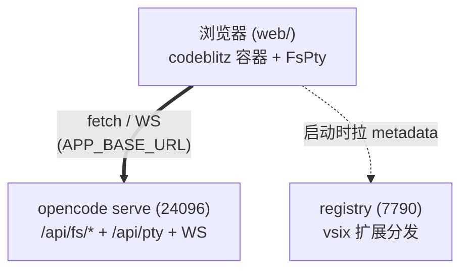
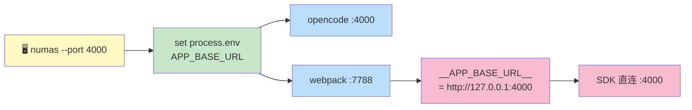
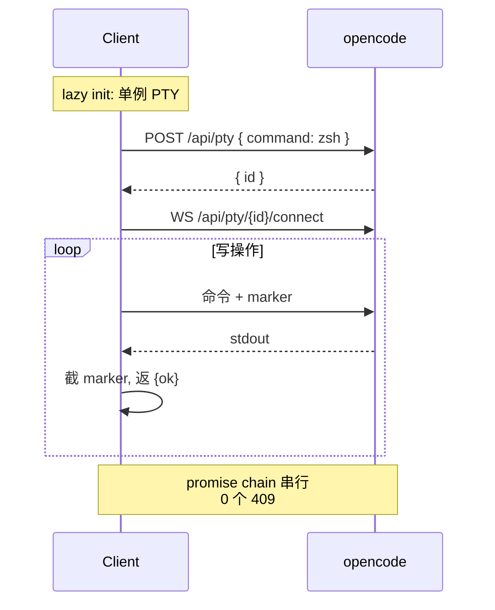

# Numas (牛马们)

> **打工人首选工作模式** — 浏览器即用的 AI 工作台, 直连 opencode, 无中间层。
> `npx github:weizuxiao911/numas` 一行启动。

## 架构



## 端口 (单一事实源: cli)



| 端 | 默认 | flag | env |
| --- | --- | --- | --- |
| opencode | 24096 | `--port` | `APP_BASE_URL` |
| webpack-dev-server | 7788 | `--web-port` | `WEB_PORT` |

## 启动

```bash
# 一次性全局装依赖 (推荐, 避免每次 npx 装)
npm i -g tsx opencode-ai

# npx (推荐)
npx github:weizuxiao911/numas                          # web 模式 (opencode + client)
npx github:weizuxiao911/numas --port 4000              # opencode 4000
npx github:weizuxiao911/numas --web-port 8000       # client 8000
npx github:weizuxiao911/numas serve                    # 只起 opencode

# git clone (本地开发)
git clone https://github.com/weizuxiao911/numas
cd numas && npm install
cd cli && npm install && cd ..
cd client && npm install && cd ..
npm run dev
```

> **升级时若行为异常**: npx 会 cache 旧 numas, 清掉重试:
> ```bash
> rm -rf ~/.npm/_npx ~/.npm/_cacache
> ```

| 服务 | 地址 |
| --- | --- |
| 工作台 | http://localhost:7788 |
| opencode | http://127.0.0.1:24096 |
| registry | https://127.0.0.1:7790 |

## 数据流



读操作走 `/api/fs/list` `/read` `/find` (全局只读); 写操作走单例 PTY (跨平台 shell-ops).

## 平台兼容

| 平台 | shell | 探测 |
| --- | --- | --- |
| macOS | zsh 优先 | `/pty/shells` |
| Linux | bash | `/pty/shells` |
| Windows | powershell / pwsh / cmd | `/pty/shells` |

中文路径: `x-opencode-directory` header 用 `encodeURI()` 防 ISO-8859-1 报错.

## 目录

```
numas/
├── cli/              # 进程编排器: bin (npx 入口) + web/serve 路由
├── web/           # codeblitz 容器 + 8 service + 4 extension
├── extensions/       # vsix 源码
├── registry/         # vsix 分发
└── package.json      # bin: numas
```

## License

MIT
