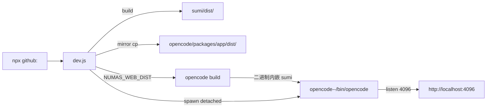

# Numas — 牛马们的 AI 工作台

> **Numas (牛马们)** — 打工人首选工作模式。
> 一个本地一体化 AI IDE, 一行命令拉起, 对标腾讯 workbuddy。

🐮

---

## 1. 这是什么

Numas = **sumi (开源 codeblitz/opensumi IDE 容器) + opencode (AI + 终端 + 文件系统本地服务)** 二合一打包。

- 纯本地, 浏览器打开就用, 跨平台 mac / linux / win
- AI 助手 / 资源管理器 / 终端 / PDF 阅读标注 / HTML 渲染 / Paper 试卷库 全内置
- 单一 4096 端口 (opencode 二进制内嵌 sumi dist)

### 设计原则

- **砍中间层**: 客户端直连 opencode (HTTP/WS), 无服务端代理, 部署简单
- **集成打包**: opencode 二进制内嵌 sumi dist, 启动即一体, 无需分别管两个进程
- **DI 解耦**: 业务只依赖接口 Token, 替换实现 / 写测试都简单
- **vsix 拓展**: 功能以 BrowserModule 注册, 独立打包, registry 分发

---

## 2. 快速开始

### 用户 (推荐)

```bash
npx -y github:weizuxiao911/numas
```

启动后浏览器自动打开 http://localhost:4096.

### 开发者

```bash
git clone https://github.com/weizuxiao911/numas
cd numas
npm install        # 装 dev.js 自身依赖 (opencode-ai 二进制 + tsx 等)
npm run dev        # = node dev.js, 集成模式
```

### 前置

| 项 | 要求 | 说明 |
|---|---|---|
| Node | ≥ 20 (LTS 推荐) | dev.js 启动强校验, < 20 直接报错退出 |
| watchexec | 自动装 | fs watcher PTY 依赖 (opencode 子进程 FSEvents 必炸, 必须 Rust FSEvents 直连). dev.js 自检自装 (mac: brew / linux: apt / win: winget) |
| opencode-ai | 自动装 | `npm i -g opencode-ai --ignore-scripts` |
| 端口 4096 | 空闲 | dev.js 启动前自动 `lsof -ti :4096` 清 zombie |

`--ignore-scripts` 跳过 spdlog native postinstall (Python 3.14 删 distutils 后 node-gyp@9 必崩), opensumi 走 JS fallback logger, 主流程不受影响.

---

## 3. 命令行参数

```bash
npx -y github:weizuxiao911/numas [flags]
```

| Flag / Env | 默认 | 说明 |
|---|---|---|
| `--port <n>` / `NUMAS_PORT` | 4096 | opencode web 端口 |
| `--registry <url>` / `NUMAS_REGISTRY` | http://127.0.0.1:7790 | vsix registry 地址 |
| `--fast` / `NUMAS_FAST=1` | off | **跳过 sumi build / cp dist / opencode build**, 只杀 port + 启 opencode (复用场景 5-10s → 1-2s). 改了前端代码必须去掉 |
| `--force-build` | off | 强制重 build (sumi + opencode), 忽略 hash 缓存 |

示例:

```bash
# 改端口
npx -y github:weizuxiao911/numas --port 8080

# 快启 (不重 build)
npx -y github:weizuxiao911/numas --fast

# 自定义 registry
npx -y github:weizuxiao911/numas --registry http://192.168.1.10:7790
```

---

## 4. 架构

### 4.1 整体 (集成模式)

dev.js 编排: 装 sumi deps + 装 opencode 全局二进制 + 装 watchexec + 杀 port → sumi build → mirror cp sumi/dist → opencode/packages/app/dist → opencode build (内嵌 sumi dist) → 启 opencode web.



**进程树** (dev.js 持有, SIGINT 杀整组):

```
dev.js (pgid=N)
  └── opencode web @ 4096 (独立 detached 进程组)
```

集成模式**只一个**进程组 (opencode 自己 serve 内嵌的 sumi dist). 老 web/ 客户端模式 (webpack-dev-server + opencode 分别跑) 已废弃.

### 4.2 客户端分层 (sumi/)

按 DI 思想分层, **业务只依赖接口 Token**, 不直接 import 实现. 后续开发人员理解这个分层就能维护系统.

```
外部 (UI / 事件)
    ↓
extensions  (sumi/src/extensions/: chat, pdf, html, opentype, paper, welcome)
    ↓
codeblitz / opensumi 容器  (@opensumi/ide-core-browser, useInjectable)
    ↓
commands  (sumi/src/commands/: IFileSystem, IAgent, tokens — 接口)
    ↓
service  (sumi/src/service/: fs, agent, env, terminal, registry — 实现)
```

**铁律**: 所有拓展文件系统操作必须走 codeblitz + opencode fs API, 严禁直连 service 层 (`__APP_FS__` FsPty). 直连易崩 (PDF 标注写 sidecar 走 `__APP_FS__.write` 标 2 个就触发 FsPty 异常), 路径分裂难维护.

| 层 | 目录 | 职责 |
|---|---|---|
| **commands** | `sumi/src/commands/` | 接口定义 (IFileSystem, IFileServiceClient 等), 业务与实现解耦 |
| **config** | `sumi/src/config/` | 容器配置 (modules 列表, layout, brand, bfs, runtime) |
| **service** | `sumi/src/service/` | 接口实现 (fs, agent, env, terminal, registry), 挂载 `window.__APP_FS__` / `__APP_OPENCODE__` |
| **extensions** | `sumi/src/extensions/` | 用户感知功能 (chat, pdf, html, opentype, paper, welcome), 自包含 (组件 + 类型 + helpers + module.ts) |
| **assets** | `sumi/src/assets/` | Logo (🐮 SVG), favicon, 字体 |
| **styles** | `sumi/src/styles/` | 全局 CSS overrides / slots |

### 4.3 内置拓展

| 拓展 | 能力 |
|---|---|
| **AI 助手** (chat) | 多 session tab, 多 model / agent 切换, token 服务商设置, 附件上传, 工作目录切换 (切 cwd → 所有 opencode SDK 调用走新 cwdHeader → 文件引用 / 终端 / 上下文跟随) |
| **资源管理器** | codeblitz file tree, 实时同步宿主机 (watchexec FSEvents 直连, 不依赖 chokidar) |
| **终端** | 接入宿主 shell, 自适应平台 (mac zsh 优先 / linux bash / win powershell) |
| **PDF 阅读 + 标注** | 5 档缩放 (50%-150%), Rect 圈选 + sidecar JSON 持久化 (`{pdf}.annotation`), AI ask popover + 批注演示动画 |
| **HTML 渲染** | 内置 HTML viewer + JS 执行, opentype 切换文本/HTML |
| **Paper 试卷库** | 题库 / 试卷库 (独立 vsix, registry 分发) |
| **主题** | 暗色 (默认) / 亮色切换 |

### 4.4 vsix 拓展 (registry 模式)

`extensions/` 内三个 vsix 源码:

| 拓展 | 目录 | 分发 |
|---|---|---|
| html | `extensions/html/` | vsix 自打包, registry @ 7790 |
| paper | `extensions/paper/` | vsix 自打包, registry @ 7790 |
| pdf | `extensions/pdf/` | 内置 (走 sumi/src/extensions/pdf, 不走 vsix) |

vsix 通过 registry HTTP 分发 (HTTPS, 自签证书 SAN + 系统信任). 用户可独立开发扩展, 在 `extensions/your-ext/` 写 vsix `package.json` + `BrowserModule`.

---

## 5. 工作原理

### 5.1 文件系统 (FsPty + SDK 读)

**读盘**: 走 opencode SDK (`client.file.read`), HTTP `/api/fs/read`, ~10ms. 频繁调用不卡.

**写盘**: 走 **FsPty** (PTY worker 跑在 opencode PTY 里), stdin/stdout JSON 协议, ~100ms+.

**FsPty 自愈** (`sumi/src/service/fs.ts`):
- **单例 + 串行队列**: `queue.then` 链保证同一 PTY 不并发, 避免命令乱序
- **超时**: 默认 10s, 写盘 30s 基础 + 1s/KB base64 (上限 5min)
- **自愈 (timeout reset)**: 超时清 self 状态, 下次 request 触发 init 重建 PTY, 业务 retry 透明恢复
- **心跳 (5s ping)**: 每 5s 发 ping op, 连续 2 次失败 → 强制 reset, 即使队列挂死也能清

**Why FsPty**: opencode session.shell 单 shell 限制 → 写文件 409 死锁. PTY 全局无 session 限制 + 串行化 = 0 个 409.

**watchexec watcher** (替代 chokidar): opencode 子进程 FSEvents 对 node 全废 (EMFILE), watchexec (Rust FSEvents 直连) 在 pty 里全事件正常, 替代 chokidar polling 的盲区 (空目录删除无事件).

### 5.2 工作目录切换全局影响

**来源优先级** (`sumi/src/service/env.ts`):
1. `localStorage.APP_CWD` (用户运行时切换) — 最高
2. `window.__APP_CONFIG__.cwd` (启动时固定) — 兜底

**全局影响**:
- opencode SDK 全部 `headers: cwdHeader()`, header = `'x-opencode-directory': encodeURI(cwd)`. 切 cwd → 所有 SDK 调用上下文跟随
- chat / pdf 标注 / 终端全部读 `effectiveCwd()`, 自动跟随

**CJK 路径**: HTTP header ISO-8859-1 限制, `x-opencode-directory` 必须 `encodeURI()` 包裹.

### 5.3 拓展注册机制

所有拓展通过 BrowserModule 在 `sumi/src/config/modules.ts` 统一注册到 codeblitz 容器. 容器提供 slot 插槽 / 命令面板 / 主题等基础设施, 拓展只关心功能逻辑.

```tsx
import { useInjectable } from '@opensumi/ide-core-browser';
import { IFileServiceClient } from '@opensumi/ide-file-service';

const fileService = useInjectable<IFileServiceClient>(IFileServiceClient);
```

---

## 6. 文档索引

| 文档 | 内容 |
|---|---|
| [AGENTS.md](./AGENTS.md) | AI 协作铁律 (技术选型 / 交互协议 / 功能设计 / 改动反馈 / 代码提交 / 分层架构 5 条铁律), 决策历史, 踩坑速查 |
| [docs/架构设计.md](./docs/架构设计.md) | 集成模式架构详细设计 |
| [docs/功能清单.md](./docs/功能清单.md) | 内置能力完整清单 |
| [docs/文件系统设计与测试用例.md](./docs/文件系统设计与测试用例.md) | FsPty / RemoteFS / BrowserFS 桥接 + 测试用例 |
| [docs/标注功能设计与测试用例.md](./docs/标注功能设计与测试用例.md) | PDF 标注 sidecar 设计 + AI ask popover + 批注演示动画 |

---

## 7. 已知限制

- **PDF 标注**: 跨页选区不支持, 不支持编辑已有标注 (只能删除重建), 无侧栏列表
- **PDF 缩放**: 5 档 (50/75/100/125/150), 不支持自定义百分比
- **多用户**: 不支持 (opencode 单实例, 无服务端)
- **历史持久化**: opencode SQLite (`~/.local/share/opencode/opencode.db`), 重启不丢

---

## 8. 排错 FAQ

**Q: 启动后浏览器没自动打开?**
A: 系统 `open` / `xdg-open` 不可用 (headless server). 手动打开 http://localhost:4096.

**Q: 端口 4096 被占?**
A: `lsof -ti :4096 | xargs kill -9` 清 zombie, 或 `--port <n>` 改.

**Q: `npm install` 卡 spdlog 报错?**
A: Python 3.14 删 distutils 后 node-gyp@9 必崩. dev.js 已加 `--ignore-scripts` 跳过, spdlog 没 build 但 opensumi 自动 fallback JS logger.

**Q: 标注保存失败 (toast "标注保存失败")?**
A: FsPty 写盘卡住, 触发自愈: 5s 后心跳检测 → 强制 reset → 下次自动重试. 持续失败可重启 dev 清 FsPty 队列.

**Q: macOS 终端中文乱码?**
A: `LANG=zh_CN.UTF-8` 环境变量.

**Q: 改了前端代码但 UI 没变?**
A: 跑 `node dev.js --force-build` 强制 rebuild, 或去掉 `--fast`.

**Q: 重启很慢?**
A: 用 `--fast` 跳过 build/cp (前提: 上次 build 后没改 sumi/src/ 或 opencode 源码).

**Q: Node 版本 < 20?**
A: dev.js 启动即报错退出, 提示安装链接 https://nodejs.org.

**Q: npx 首次执行不提示确认?**
A: 加 `-y` 跳过 (`npx -y github:weizuxiao911/numas`). 缓存失败 `rm -rf ~/.npm/_npx`.

---

## 9. 关闭

`Ctrl+C` → dev.js 杀整组 (opencode + 二进制进程).

---

## License

MIT