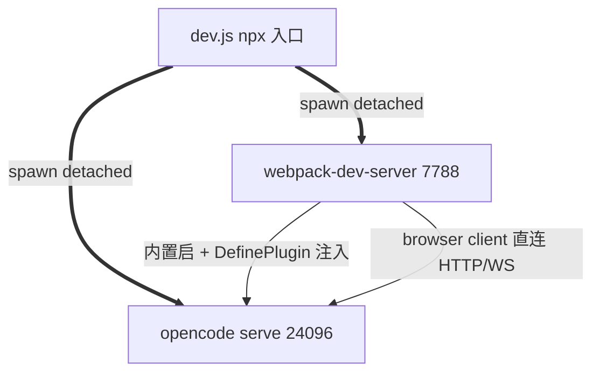
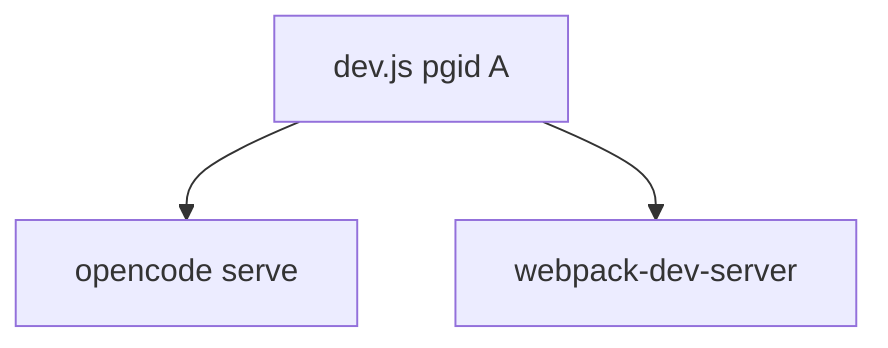

# Numas

## 1. 背景说明

Numas 是一个**纯浏览器 + 本地 CLI** 的 AI 工作台, 直连 opencode, 无中间层。

```bash
npx -y github:weizuxiao911/numas
```

一行命令启动, 自动装依赖 (web deps + opencode 二进制), 启两个进程 (opencode serve + webpack-dev-server), 4 秒后自动打开浏览器到 `http://localhost:7788`。

**设计原则**:
- 砍中间层 (client → opencode 直连 HTTP/WS, 无服务端代理)
- 部署简单 (`npx` 一行, 跨平台 mac/linux/win)
- 纯前端 React + codeblitz/opensumi 容器渲染 PDF / 代码 / 终端
- 业务模块通过 DI 解耦, 可替换可测试

## 2. 核心功能

| 模块 | 能力 |
|---|---|
| **AI 助手** | 会话管理、会话切换、AI 对话、模型切换、token 服务商设置、附件上传、工作目录切换 |
| **资源管理器** | 完整的文件系统功能, 支持实时文件读写和刷新, 保证 Numas 与外围文件读写数据一致 |
| **终端** | 接入宿主 shell, 自适应平台类型 (macOS / Windows / Linux) |
| **主题** | 暗色 (默认) / 亮色主题切换 |

**内置服务**: PDF (阅读和交互编辑, 目录与页面快速切换) / HTML (HTML 渲染与 JS 执行)

## 3. 安装部署

### 启动

```bash
# 方式 1: npx (推荐, 自动装好)
npx -y github:weizuxiao911/numas

# 方式 2: 本地开发
git clone https://github.com/weizuxiao911/numas && cd numas
npm install
npm run dev
```

启动后浏览器自动打开 `http://localhost:7788`。
**唯一前置**: Node ≥ 20 (LTS 推荐), npm 10+。

### 端口

| 端 | 默认 | 修改方式 |
|---|---|---|
| opencode | 24096 | `--server-port` flag 或 `web/.env.development` 的 `OPENCODE_PORT` |
| webpack-dev-server | 7788 | `--web-port` flag 或 `web/.env.development` 的 `WEB_PORT` |

```bash
npx -y github:weizuxiao911/numas --server-port 24097 --web-port 8080
```

CORS: opencode 默认 `cors=*`, 客户端直连无需代理。

### 平台

| 平台 | shell | 状态 |
|---|---|---|
| macOS | zsh 优先 | ✓ |
| Linux | bash | ✓ |
| Windows | powershell / pwsh / cmd | ✓ |

### 关闭

`Ctrl+C` → dev.js 杀整组 (opencode + webpack)。

### 部署提示

| 项 | 说明 |
|---|---|
| 自装依赖 | `dev.js` 自动 `npm install --ignore-scripts` (跳 native postinstall) + `npm i -g opencode-ai` (~50MB) |
| 端口冲突 | 启动前自动 `lsof -ti :7788 :24096` 清 zombie |
| 自动开浏览器 | 启动后 4s, 失败仅 warn (headless server 兼容) |
| npm warn | `spdlog deprecated` 可忽略 (opensumi 传递依赖, 已用 JS fallback) |
| 升级失败 | `rm -rf ~/.npm/_npx ~/.npm/_cacache` 清 npx 缓存 |

## 4. 设计思想

### 4.1 整体架构 (codeblitz + opencode 通过 dev.js 串联)



**进程树** (dev.js 持有, 同进程组, SIGINT 杀整组):



**闭环**:
- `dev.js` 启两个 detached 进程 (opencode serve + webpack-dev-server)
- `webpack.config.js` 编译期读 `OPENCODE_PORT` / `APP_BASE_URL`, 通过 `DefinePlugin` 注入到 `window.__APP_CONFIG__.appBaseUrl`, 客户端直连 opencode
- 无中间层 HTTP 代理, 0 个 409 死锁, 部署简单 (`npx` 一行)

### 4.2 分层设计 (web/)

按 DI 思想分层, 业务只依赖**接口** (Token/Service), 不直接 import 实现。后续开发人员理解这个分层就能维护系统。

| 层 | 目录 | 职责 | 依赖 |
|---|---|---|---|
| **commands** | `src/commands/` | 接口定义 (IFileSystem, IAgent, IFileServiceClient 等), 业务与实现解耦 | 无 |
| **config** | `src/config/` | 容器配置 (modules 列表, layout, brand, bfs, runtime) | commands |
| **service** | `src/service/` | 接口实现 (fs, agent, env, terminal, registry), 暴露 Promise 接口, 挂载 `window.__APP_FS__` 等 | commands |
| **extensions** | `src/extensions/` | 用户感知功能 (pdf, chat, html, welcome), 自包含 (组件 + 类型 + helpers + module.ts) | commands + container (DI) |

**DI 机制**: 业务通过 `useInjectable(Token)` 拿服务, 不 import service 文件 (避免循环依赖)。service 内部实现细节 (PTY 队列 / 心跳 / cwd) 业务无感。

```tsx
// 业务层典型用法 (以 chat 为例)
import { useInjectable } from '@opensumi/ide-core-browser';
import { IFileServiceClient } from '@opensumi/ide-file-service';
const fileService = useInjectable<IFileServiceClient>(IFileServiceClient);
```

### 4.3 内置拓展 (codeblitz 交互拓展容器)

codeblitz/opensumi 是**交互拓展容器**, 一切业务行为/交互都通过**拓展** (BrowserModule) 实现, 由 `web/src/config/modules.ts` 统一注册到容器。容器提供 slot 插槽 / 命令面板 / 主题等基础设施, 拓展只关心功能逻辑。

#### chat (AI 助手)

- **核心功能**: 接入 opencode SDK 跑 LLM, 多 session tab, 多 model / agent 切换, token 服务商设置, 附件上传, 工作目录切换
- **工作目录切换全局影响**: 切工作目录 (`localStorage.APP_CWD`) → `effectiveCwd()` 重新读 → 所有 opencode SDK 调用走新的 `cwdHeader` (`x-opencode-directory: encodeURI(cwd)`) → 上下文 (文件 / 命令) 跟随新目录。这是**全局开关**, 影响 chat 文件引用 / 终端 cwd / 所有 SDK 调用

#### pdf (PDF 工具)

- **功能说明**: 打开 `.pdf` 文件进入阅读模式, 高度主导缩放 (5 档 50%-150%), Rect 框选创建标注, hover X 删除, sidecar JSON 持久化到 `.{pdf}.annotation`
- **核心设计逻辑**:
  - **高度主导缩放**: `pageH = opensumi-editor.clientHeight × 档位`, `pageW = pageH × PDF aspect`. 缩放档位变化触发全 rebuild
  - **Rect 圈选 + 坐标换算**: mousedown/move/up 画蓝色蒙层, mouseup 算 `pdfX/Y = cssX/Y / pageW/H × pb.width/height` (左下原点, y 翻转)
  - **sidecar 持久化**: `.{pdfBasename}.annotation`, IDE 相对路径 `/.{basename}.annotation`, read-merge-write + debounce 500ms + SHA-256 自写去重
  - **重建策略**: 缩放档位变化 → 全 rebuild (274 页); sidecar 变化 (保存/删除/外部同步) → 只 rebuild 当前页. 拆分 useEffect deps 隔离触发范围
  - **弹出到 body**: popover portal 到 `document.body` + z-index 99999, 避免被 chat panel 遮挡

## 5. 工作原理

### 5.1 文件系统如何实现

**分层**:
- **读盘**: 走 opencode SDK (`client.file.read`), HTTP `/api/fs/read`, ~10ms. 频繁调用不卡
- **写盘**: 走 FsPty (PTY worker, 跑在 opencode PTY 里), stdin/stdout JSON 协议, ~100ms+

**FsPty 自愈** (`src/service/fs.ts`):
- **单例 + 串行队列**: `queue.then` 链保证同一 PTY 不并发, 避免命令乱序
- **超时**: 默认 10s, 写盘 30s 基础 + 1s/KB base64 (上限 5min)
- **自愈 (timeout reset)**: 超时时清 self 状态 (`initPromise` / `ws` / `ptyId`), 下次 request 触发 init 重建 PTY, 业务 retry 透明恢复
- **心跳 (5s ping)**: 每 5s 发 `ping` op, 连续 2 次失败 (~10s 无响应) → 强制 reset, 即使队列挂死也能清

**BrowserFS 桥接**: opensumi 容器 → `RemoteFS` (`web/src/config/bfs.ts`) → `__APP_FS__` (`web/src/service/fs.ts`) → 读 SDK / 写 FsPty. 同一链路, 缓存零散。

### 5.2 工作目录切换全局影响

**来源优先级** (`src/service/env.ts:39-42`):
1. `localStorage.APP_CWD` (用户运行时切换) — 最高
2. `window.__APP_CONFIG__.cwd` (启动时固定) — 兜底

**全局影响**:
- **opencode SDK 调用**: 全部 `headers: cwdHeader()`, header = `'x-opencode-directory': encodeURI(cwd)`. 切 cwd → 所有 SDK (file / find / pty / event) 上下文跟随
- **FsPty 初始化**: 启动时 `effectiveCwd()` 决定 PTY 进程的工作目录. **切 cwd 不重建 FsPty** (cwd 切换是当前已知遗留 — 后续需修)
- **chat / pdf 标注 / 终端**: 全部读 `effectiveCwd()`, 自动跟随

**当前限制**: 工作目录切换**不**触发 FsPty 重建, 写盘路径基于启动时的 cwd. 这是已知遗留, 修法: 监听 cwd 变化 → `resetFsPty()` 强制销毁, 下次 getFsPty() 重建。

### 5.3 全局定义了哪些可以给拓展使用

**接口层** (`web/src/commands/`): 业务层与实现层的契约, 拓展通过 DI 拿。

| 接口 | 来源 | 提供能力 |
|---|---|---|
| `IFileSystem` | `web/src/commands/fs.ts` | list / read / readBinary / write / rm / mkdirp / move / meta / exists / find |
| `IFileServiceClient` | `@opensumi/ide-file-service` | opensumi 容器内文件操作 (BrowserFS 走 `__APP_FS__`) |
| `IAgentService` | `web/src/commands/agent.ts` (待定义) | opencode SDK 高阶封装 (session / model / agent 列表) |
| `ITerminalController` | `@opensumi/ide-terminal-next` | 终端生命周期 (创建 / 销毁 / 聚焦) |
| `IEditorDocumentModelService` | `@opensumi/ide-editor` | 编辑器文档模型 (untitled tab 内容写入) |
| `WorkbenchEditorService` | `@opensumi/ide-editor` | 编辑器服务 (open / focus) |

**全局挂载** (`web/src/index.tsx`): 非 DI 场景 (setTimeout 回调 / DOM 事件) 通过 `window.__APP_FS__` / `window.__APP_OPENCODE__` 拿服务。

| 全局变量 | 类型 | 用途 |
|---|---|---|
| `window.__APP_CONFIG__` | `{ appBaseUrl, cwd, defaultShell }` | 编译期注入的 opencode 地址 + 初始 cwd |
| `window.__APP_FS__` | `IFileSystem` | 非 DI 场景读盘/写盘 (e.g. sidecar.ts 写盘) |
| `window.__APP_OPENCODE__` | `createOpencodeClient` SDK 实例 | 非 DI 场景 SDK 调用 |
| `window.__APP_AGENT__` | 高阶 API (session / model / agent) | chat 拓展非 DI 场景 |

## 6. 注意事项

### 6.1 已知限制 (一期)

- **PDF 标注**: 跨页选区不支持, 不支持编辑已有标注 (只能删除重建), 无侧栏列表, 无删除撤销, 无删除确认弹窗
- **PDF 缩放**: 5 档 (50/75/100/125/150), 不支持自定义百分比
- **多用户**: 不支持 (opencode 单实例, 无服务端)
- **历史持久化**: opencode SQLite (`~/.local/share/opencode/opencode.db`), 重启不丢

### 6.2 常见问题

**Q: 启动后浏览器没自动打开?**
A: 系统 `open` / `xdg-open` 不可用 (headless server). 手动打开 `http://localhost:7788`。

**Q: 端口被占?**
A: `lsof -ti :7788 :24096 | xargs kill -9` 清 zombie, 或 `--web-port` / `--server-port` 改。

**Q: 标注保存失败 (toast "标注保存失败")?**
A: FsPty 写盘卡住, 触发自愈: 5s 后心跳检测 → 强制 reset → 下次自动重试。持续失败可重启 dev 清 FsPty 队列。

**Q: 重启后标注丢失?**
A: 标注存 `.{pdf}.annotation`, 丢失说明 sidecar 文件被删。检查 PDF 同目录。

**Q: macOS 终端中文乱码?**
A: `LANG=zh_CN.UTF-8` 环境变量。

**Q: web 能离线用吗?**
A: 不能。需 opencode 本地跑 (提供 AI + 文件系统 + 终端)。

**Q: 怎样扩展 (加自己的 extension)?**
A: `extensions/your-ext/` 写 vsix `package.json` + `BrowserModule`, 在 `web/src/config/modules.ts` 注册, 编译时打包。

### 6.3 性能与限制

- **FsPty 写盘**: ~100ms-几秒 (PTY 启动 + 命令构造), chunked 4KB base64, 大文件不撑爆 ws
- **FsPty 写超时**: 30s 基础 + 1s/KB base64, 上限 5min (`fs.ts:923-925`)
- **重建 274 页**: 1-3 秒 (canvas 异步渲染 + IO 懒加载)
- **标注边长**: 1000+ 标注走 IO 懒加载 + 按 page 索引, 性能不受影响

### 6.4 排错清单

| 现象 | 原因 | 修法 |
|---|---|---|
| 端口 7788 占用 | dev 残留 | `lsof -ti :7788 \| xargs kill -9` |
| opencode 启动慢 | PTY 冷启 | 等 5-10s |
| npm install 卡 spdlog | Python 3.14 无 distutils | `--ignore-scripts` 跳过 (dev.js 已加) |
| 中文路径 404 | cwdHeader | 已 `encodeURI`, 升级后问题 |
| 标注保存失败 | FsPty 卡 | 心跳自愈, 重启 dev 兜底 |
| Mac 弹窗 click 无效 | popover z-index | 已 portal 到 body + z-index 99999 |

### 6.5 目录结构

```
numas/
├── dev.js              # npx 入口
├── package.json        # bin: numas
├── web/                # 核心客户端
│   ├── src/
│   │   ├── App.tsx
│   │   ├── index.tsx
│   │   ├── config/     # layout, modules, brand, bfs
│   │   ├── commands/   # 接口定义
│   │   ├── service/    # fs, agent, env, terminal
│   │   ├── extensions/ # pdf, chat, html, welcome
│   │   ├── assets/
│   │   └── styles/
│   ├── webpack.config.js
│   └── package.json
├── extensions/         # vsix 源码
├── registry/           # vsix 分发 (dev 不起)
├── .tmp/               # 临时日志/截图 (gitignore)
├── pdf标注设计.md       # PDF 标注功能设计 + 实施记录
├── README.md           # 本文件
└── AGENTS.md           # AI 协作铁律
```

## License

MIT
