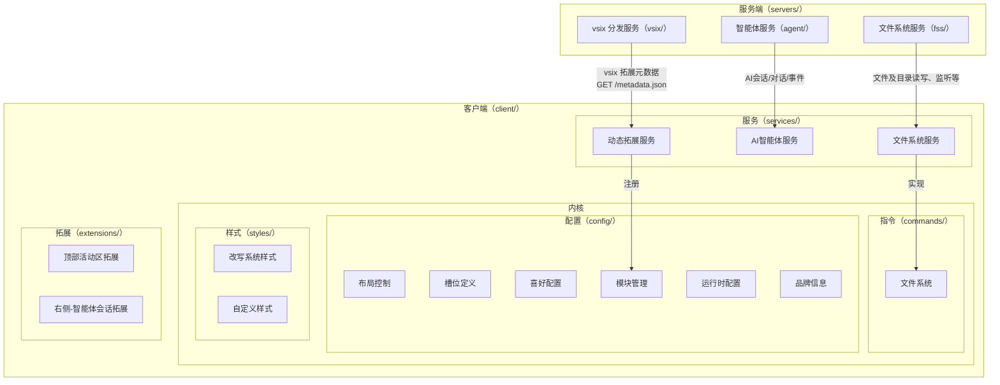

# Magicbook

浏览器端可交互工作台，采用 **C/S（客户端/服务器）架构**，分两层：

- **servers/**：服务端，提供真实可用的服务示例实现，对应 **3 套协议标准**（agent / registry / fss）
- **client/**：客户端，基于 opensumi/codeblitz 构建，`client/services/` 内置 **3 套标准协议**（registry / assistant / filesystem）

## 总体架构



## 分层

### servers（服务端）

提供服务器端支持，核心是给出**真实可用的服务示例实现**。对应 **3 套协议标准的实现**——关键是协议标准本身，而不是部署成 1 个服务还是 3 个服务：

| servers 组件 | 对应协议标准 | 职责 |
| --- | --- | --- |
| `agent/` | assistant 协议 | 按请求提供 AI 服务；简单实现即为每个用户创建 `opencode serve`，全量代理转发接口请求 |
| `registry/` | registry 协议 | 维护 opensumi 兼容的 VSCode 拓展标准，开发 vsix 拓展，实现 opensumi 的 ext-host 协议服务器（vsix 分发 / 元数据） |
| `fss/` | filesystem 协议 | 文件系统服务器端，提供完整的文件系统 API 接口 |

### client（客户端）

基于 opensumi/codeblitz 构建，`client/services/` 内置 **3 套标准协议**，与 servers 一一对应：

| client/services 协议 | 对接配置 | 实现方式 |
| --- | --- | --- |
| `registry` 协议 | `REGISTRY_BASE_URL` | 按 opensumi 兼容的 VSCode 拓展标准（vsix 的 ext-host 协议）对接 servers/registry，完成**动态拓展注册** |
| `assistant` 协议 | `OPENCODE_BASE_URL` | 引入 `opencode-ai/sdk` 创建实例，对接 servers/agent，**供全局使用** |
| `filesystem` 协议 | `FS_BASE_URL` | 按 opensumi 文件系统协议创建文件系统管理实例，对接 servers/fss，**供全局使用** |

服务端对客户端只暴露 3 个配置：`REGISTRY_BASE_URL` / `OPENCODE_BASE_URL` / `FS_BASE_URL`；客户端按对应协议实例化后全局消费。

### 三条协议链

1. **vsix → registry → modules**：registry 协议（动态拓展注册）。servers/registry（ext-host 协议服务器）经 `GET /metadata.json` 向 client `registry` 协议提供元数据，注册进 `config/` 的模块管理。
2. **fss → fs → ifs**：filesystem 协议。servers/fss 提供文件系统 API，client `filesystem` 协议承接后实现 `commands/` 的文件系统接口。
3. **agent → opencode**：assistant 协议。servers/agent（`opencode serve`）提供 AI 会话 / 对话 / 事件，client `assistant` 协议（opencode SDK）对接并供 chat 拓展消费。

### 分层规则

1. 系统采用 **C/S 架构**，只分 2 层：servers（服务端）与客户端（client/）；跨层只通过 **3 套协议标准**（registry / assistant / filesystem）交互。
2. servers 是协议标准的**服务端实现**，client/services 是协议标准的**客户端消费**；协议标准是契约，服务个数只是部署形态。
3. 服务端只暴露 `REGISTRY_BASE_URL` / `OPENCODE_BASE_URL` / `FS_BASE_URL` 三个配置；client/services 按协议实例化后供全局使用。
4. 内核只定义接口与配置，不承载实现；服务只实现协议客户端与对接外部；拓展只消费能力与渲染，不直连服务端。

## 模块划分

| 子工程 | 路径 | 职责 |
| --- | --- | --- |
| **servers** | [`servers/`](./servers/) | 服务端：3 套协议标准的服务端实现（agent / registry / fss） |
| **client** | [`client/`](./client/) | 客户端：基于 opensumi/codeblitz 的交互层 |

## 开发

```bash
npm install
npm run dev     # servers + client 并发启动
npm run build   # 生产构建
```

各子工程的细节见其各自 `README.md` / `AGENTS.md`。

## License

MIT
