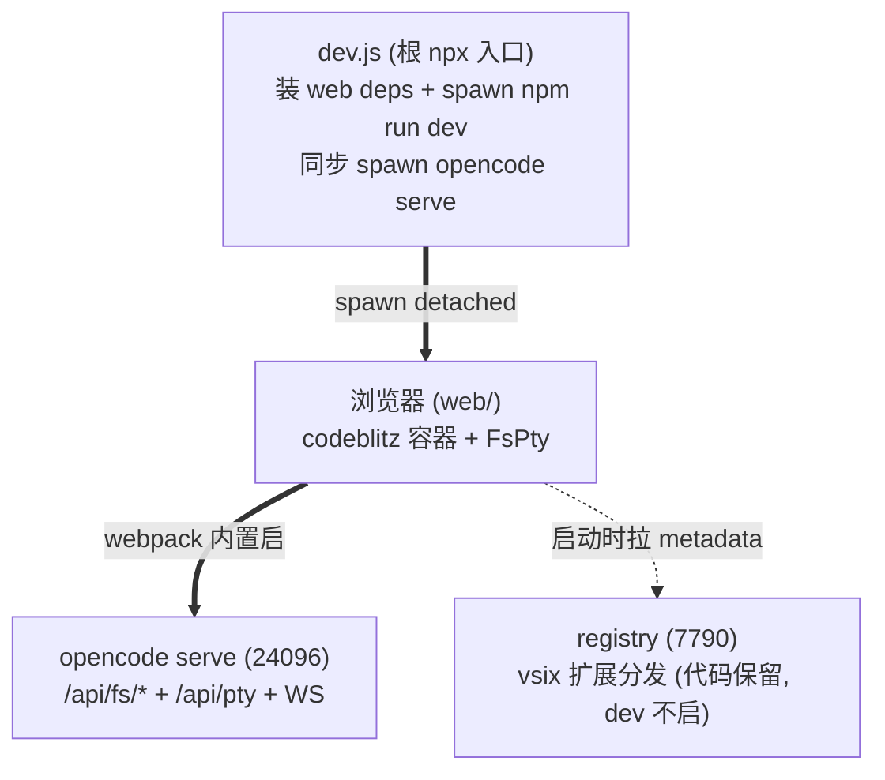
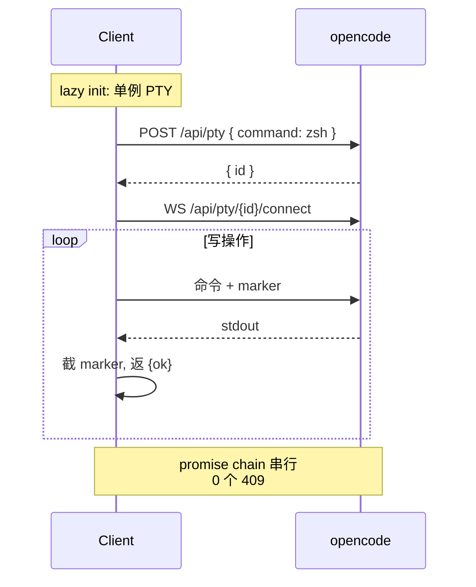

# Numas (牛马们)

> **打工人首选工作模式** — 浏览器即用的 AI 工作台, 直连 opencode, 无中间层。
> `npx -y github:weizuxiao911/numas` 一行启动。

## 架构



进程树: `dev.js → { opencode, webpack }` (两个独立 detached 进程组).

## 端口 (单一事实源: webpack env)

| 端 | 默认 | env |
| --- | --- | --- |
| opencode | 24096 | `OPENCODE_PORT` |
| webpack-dev-server | 7788 | `WEB_PORT` / `OPENCODE_WEB_PORT` |

`web/.env.development` 提供默认; webpack.config.js 编译期读 env var, 兜底读 .env。

## 启动

```bash
# npx (推荐, 一次装好)
npx -y github:weizuxiao911/numas                          # web 模式 (opencode 24096 + client 7788)
npx -y github:weizuxiao911/numas web                      # 等价 (默认子命令)

# git clone (本地开发)
git clone https://github.com/weizuxiao911/numas
cd numas && npm install
npm run dev
```

`dev.js` = npx 入口, 也可直接 `node dev.js` (跳过 npm 启动开销). 接受 flag:
- `--server-port <n>` opencode 端口 (默认 24096)
- `--web-port <n>` webpack 端口 (默认 7788)`dev.js` 首次会:
1. 检查 `web/node_modules/.bin/webpack` — 没装则 `npm install --include=dev` (react + codeblitz + webpack)
2. 检查 `web/node_modules/.bin/opencode` — 没装则 `npm install --no-save opencode-ai` (~50MB 二进制)
3. spawn `npm run dev --prefix web` (detached + 进程组, 退出 cli 杀整组)

| 服务 | 地址 |
| --- | --- |
| 工作台 | http://localhost:7788 |
| opencode | http://127.0.0.1:24096 |
| registry | (代码保留, dev 不起) |

## 部署提示

| 项 | 说明 |
| --- | --- |
| 环境要求 | Node ≥ 18 (推荐 LTS); macOS / Linux / Windows 全平台; npm 10+ |
| 首次启动 | `dev.js` 会自动 `npm install --ignore-scripts` (跳过 native postinstall), 约 1-2 分钟装 web deps |
| 自动打开 | 启动后 4s 自动调系统浏览器打开 `http://localhost:7788` (mac=open / linux=xdg-open / win=start); 失败仅 warn |
| 预期警告 | `npm warn deprecated spdlog@0.9.0` 可忽略 — spdlog 是 opensumi 传递依赖, native build 已用 `--ignore-scripts` 跳过, opensumi 走 JS fallback logger |
| 关闭 | 终端 `Ctrl+C` → dev.js 杀整组进程 (opencode + webpack) |
| 端口冲突 | 旧 dev 残留 → 手动 `lsof -ti :7788 :24096 \| xargs kill -9` (macOS BSD lsof 必须带冒号) |
| 升级异常 | npx 缓存命中失败记录 → 清掉重试: `rm -rf ~/.npm/_npx ~/.npm/_cacache` |

## 数据流



读操作走 `/api/fs/list` `/read` `/find` (全局只读); 写操作走单例 PTY (跨平台 shell-ops)。

## 平台兼容

| 平台 | shell | 探测 |
| --- | --- | --- |
| macOS | zsh 优先 | `/pty/shells` |
| Linux | bash | `/pty/shells` |
| Windows | powershell / pwsh / cmd | `/pty/shells` |

中文路径: `x-opencode-directory` header 用 `encodeURI()` 防 ISO-8859-1 报错。

## 目录

```
numas/
├── dev.js              # npx 入口: 装 web deps + spawn opencode + npm run dev
├── package.json        # bin: numas → ./dev.js
├── web/                # codeblitz 容器 + 8 service + 4 extension
│   ├── webpack.config.js  # 内置启 opencode + 清理
│   └── package.json
├── extensions/         # vsix 源码
├── registry/           # vsix 分发 (代码保留, dev 不起)
└── .tmp/               # 临时日志/截图 (gitignore)
```

## License

MIT
