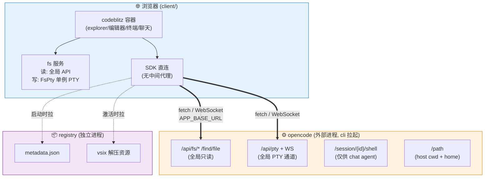
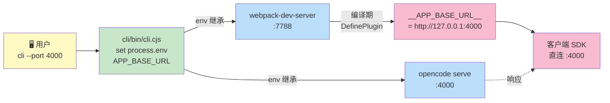
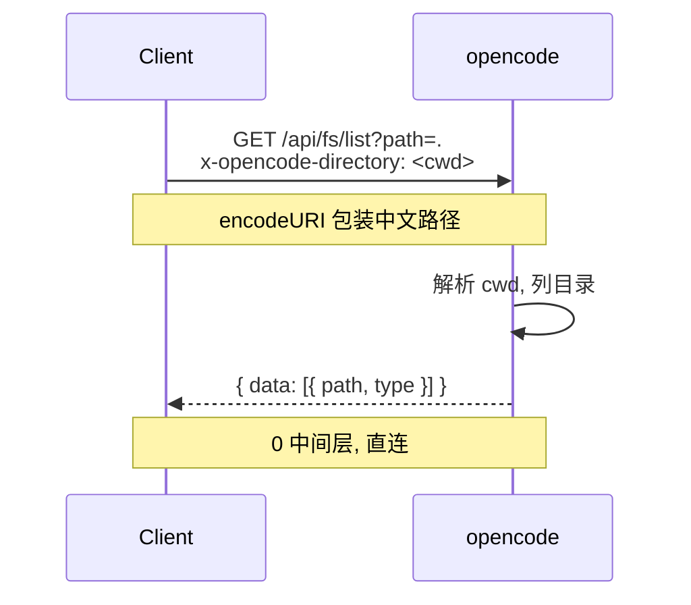
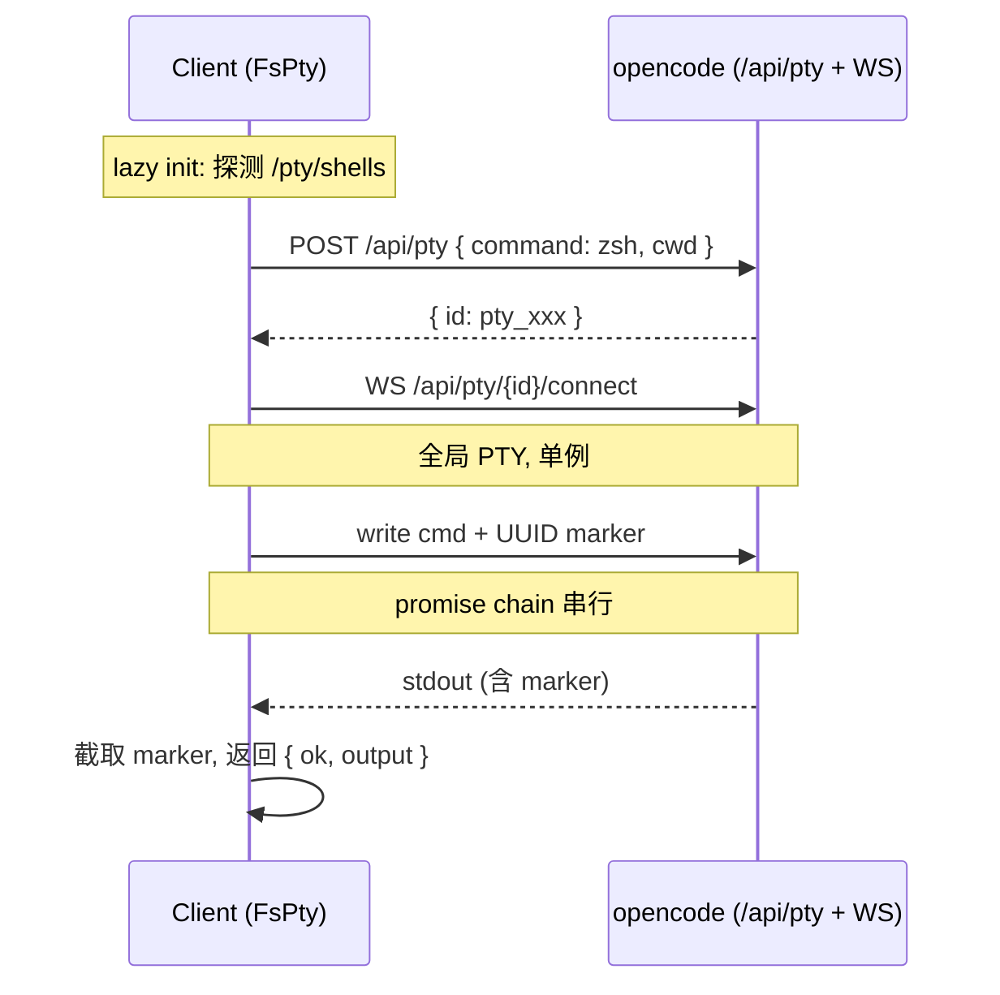
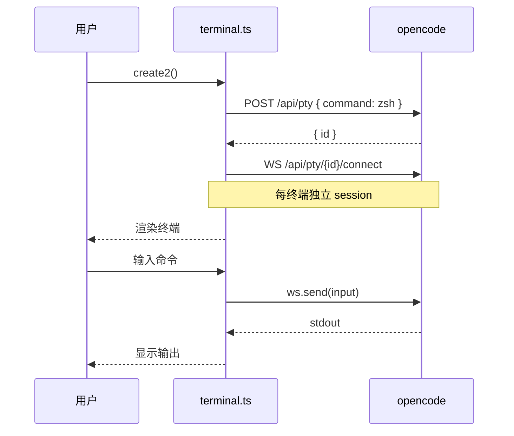
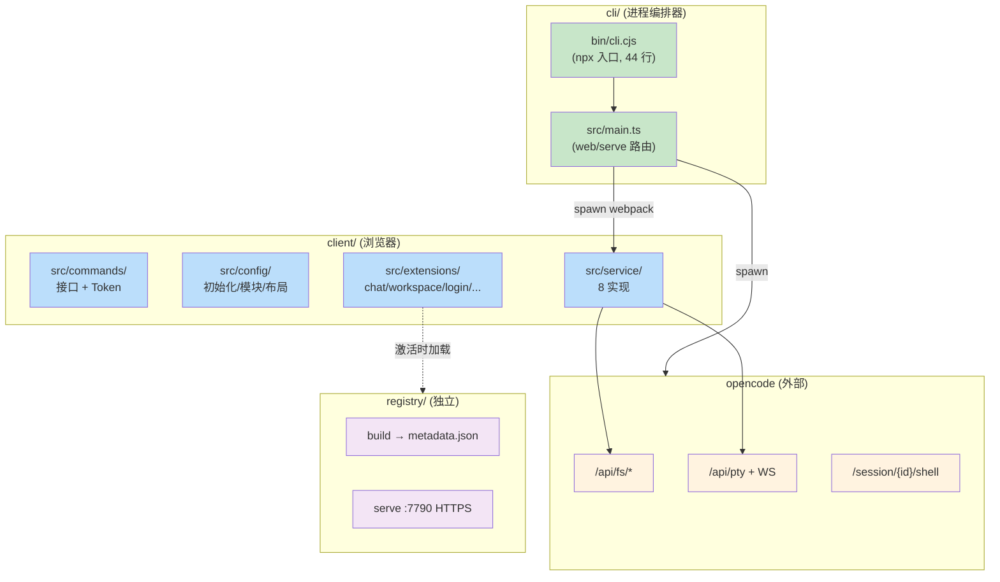
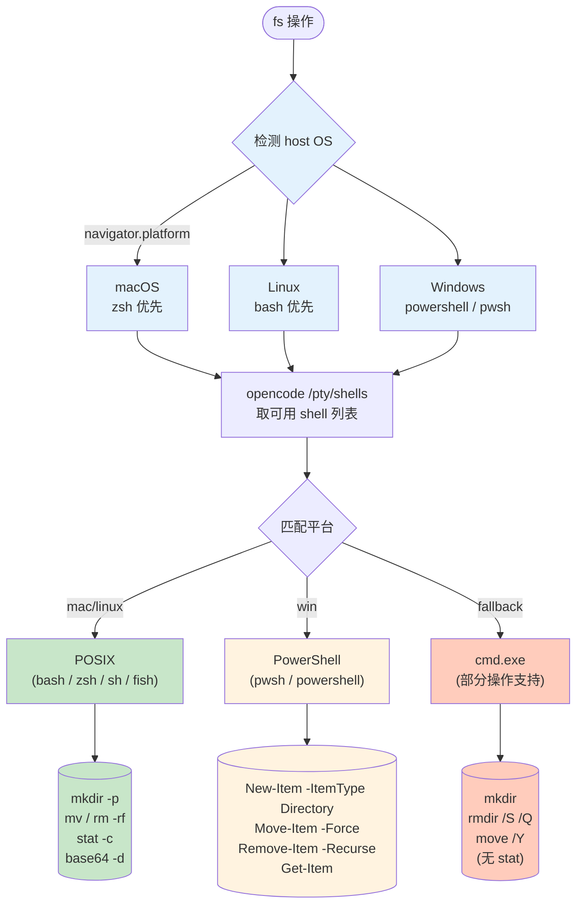
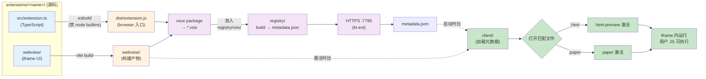

# AI 工作台

> 浏览器端可交互工作台（本地模式）。`codeblitz` 全局交互容器 直连 `opencode` 后端，`registry` 提供 vsix 扩展分发。
> `npx github:weizuxiao911/magicbook` 一行启动。

## 架构总览



## 端口单一事实源 (cli)



| 端 | 默认 | cli flag | env var |
| --- | --- | --- | --- |
| opencode | 3100 | `--port` | `APP_BASE_URL` (= `http://127.0.0.1:<port>`) |
| webpack-dev-server | 7788 | `--client-port` | `CLIENT_PORT` |
| opencode 绑定地址 | 127.0.0.1 | `--hostname` | — |
| CORS allow-origin | 派生 | (auto, 跟 `--client-port`) | — |

## 数据流

### fs 读 (list / read / find / meta)



### fs 写 (write / rm / mkdir / move / readBinary)



### terminal (用户开终端)



## 组件



| 端 | 目录 / 进程 | 职责 |
| --- | --- | --- |
| cli 编排器 | `cli/bin/cli.cjs` + `cli/src/main.ts` | npx 入口; 解析参数; 拉起 opencode + webpack 子进程; 进程组清理 |
| 客户端 | `client/` | codeblitz 容器 + 8 service + 4 内置 extension |
| 客户端 | `client/src/commands/` | 接口 + Token 定义 (IAgent/IRegistry/IFileSystem/IEnvService/IAuth) |
| 客户端 | `client/src/config/` | 初始化 / 模块注册 / 布局 / runtime config |
| 客户端 | `client/src/styles/` | CSS 覆盖 |
| 客户端 | `client/src/extensions/` | 拓展 (chat/workspace/login/actions/welcome) |
| 后端 | opencode (外部进程) | AI 推理 + 终端 PTY + 文件系统; cli 拉起的子进程 |
| 扩展 | `extensions/<name>/` | vsix 源码 (html-preview / paper) |
| 分发 | `registry/` (独立进程) | vsix 扩展分发 (build → metadata.json + 静态资源) |

## 启动方式

```mermaid
graph TD
    Start([用户]) --> Choice{选择启动方式}
    Choice -->|npx<br/>推荐| Npx["npx github:weizuxiao911/magicbook<br/>自动 clone + 装依赖 + 跑 bin"]
    Choice -->|git clone<br/>本地开发| Git["git clone ...<br/>npm install<br/>npm run dev"]
    Npx --> Mode{模式}
    Git --> Mode
    Mode -->|web<br/>默认| Web["启 opencode + webpack<br/>:3100 + :7788"]
    Mode -->|serve| Serve["只启 opencode<br/>:3100"]
    Web --> End([打开 http://localhost:7788])
    Serve --> End2([CLI 调用 API])

    classDef start fill:#fff9c4
    classDef npx fill:#c8e6c9
    classDef git fill:#bbdefb
    classDef mode fill:#f8bbd0
    classDef end fill:#d1c4e8
    class Start start
    class Npx npx
    class Git git
    class Mode mode
    class Web,Serve npx
    class End,End2 end
```

```bash
# 1. npx (推荐, 公共仓库)
npx github:weizuxiao911/magicbook
npx github:weizuxiao911/magicbook --port 4000          # opencode 4000
npx github:weizuxiao911/magicbook --client-port 8000   # webpack 8000
npx github:weizuxiao911/magicbook serve                # 只起 opencode

# 2. git clone (本地开发)
git clone https://github.com/weizuxiao911/magicbook
cd magicbook && npm install
cd cli && npm install && cd ..
cd client && npm install && cd ..
npm run dev
```

| 端 | 地址 | 说明 |
| --- | --- | --- |
| 工作台 | http://localhost:7788 | 浏览器入口 |
| opencode | http://127.0.0.1:3100 | AI + 终端 + 文件系统 |
| registry | https://127.0.0.1:7790 | 扩展分发 (需 `cd registry && npm run dev`) |

## 平台兼容



| 平台 | shell | fs 命令 |
| --- | --- | --- |
| macOS | /bin/zsh (默认) / bash | `mkdir -p` / `mv` / `rm -rf` / `stat -c` / `base64 -d` |
| Linux | /bin/bash | (同上) |
| Windows | powershell / pwsh | `New-Item` / `Move-Item -Force` / `Remove-Item -Recurse` / `Get-Item` |
| Windows 兜底 | cmd.exe | `mkdir` / `rmdir /S /Q` / `move /Y` (无 stat) |

## 扩展机制



**扩展开发规范**:
- **一律 TypeScript** (`src/extension.ts` + esbuild → `dist/extension.js`)
- **webview 单独维护** (`webview/` 目录, 不内联拼 HTML)
- **publisher 统一 `weizuxiao911`**
- **vsix 文件名** `{发布者}.{拓展名称}-{版本}.vsix`
- **MIT** 开源协议

激活链路: `metadata → 打开文件 → onCustomEditor:<viewType> → 拉 browser 入口 → provider 注册 → resolve webview`

### 首次运行: 信任 registry 证书

```bash
sudo security add-trusted-cert -d -r trustRoot -k /Library/Keychains/System.keychain \
  /Users/weizuxiao911/.../registry/certs/cert.pem
```

(证书已含 SAN: `localhost` + `127.0.0.1`)

## 目录

```
magicbook/
├── package.json            # 顶层 bin (cli) + dev/serve scripts
├── cli/                    # 进程编排器
│   ├── bin/cli.cjs         # npx 入口 (CommonJS, 44 行)
│   ├── src/main.ts         # web/serve 路由 + opencode/webpack 进程管理
│   └── package.json        # devDeps: tsx + typescript
├── client/                 # codeblitz 容器
│   ├── package.json        # deps + devDeps
│   ├── webpack.config.ts   # 内嵌; 端口读 process.env.CLIENT_PORT
│   ├── .env.development    # cli 不走时的兜底
│   ├── src/commands/       # 接口 + Token (平铺)
│   ├── src/config/         # 初始化 / 模块 / 布局 / runtime
│   ├── src/service/        # 8 实现
│   ├── src/extensions/     # chat / workspace / login / actions / welcome
│   └── src/styles/         # CSS
├── extensions/             # vsix 扩展源码 (html-preview / paper)
├── registry/               # vsix 扩展分发 (独立进程, :7790)
└── LICENSE                 # MIT
```

## 技术选型速览

| 层 | 选型 | 原因 |
| --- | --- | --- |
| npx 入口 | `cli/bin/cli.cjs` (CommonJS) | npx 调 .js 文件 (不能 TS), 必须 JS; 内部 spawn tsx 跑 TS |
| 进程编排 | `tsx` 统一 | 替代历史 ts-node, 启动快 ~300ms |
| 写操作 | 单例 PTY (FsPty) | 绕开 opencode session 单 shell 限制 (409) |
| 读操作 | opencode 全局 API | 轻量、高频, 无 session 限制 |
| 终端 | `/pty/{id}/connect` WS | 每终端独立 session, 不冲突 |
| 端口注入 | `process.env` | 单一事实源, cli → webpack → client 一条链 |
| 平台兼容 | `/pty/shells` 探测 + 平台分流 | macOS=zsh, Linux=bash, Windows=powershell |
| CJK 路径 | `encodeURI` header | HTTP header 限制 ISO-8859-1, 浏览器自动 |
| 依赖 | root 只 `tsx`, cli 只 `tsx`, client 全套 | 各管各, 互不污染 (-98% root size) |

## License

MIT
