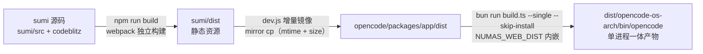
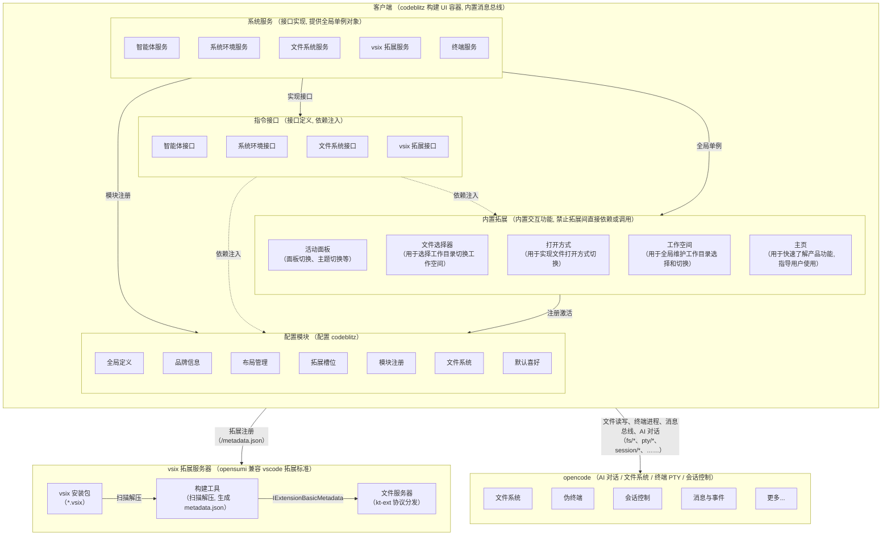
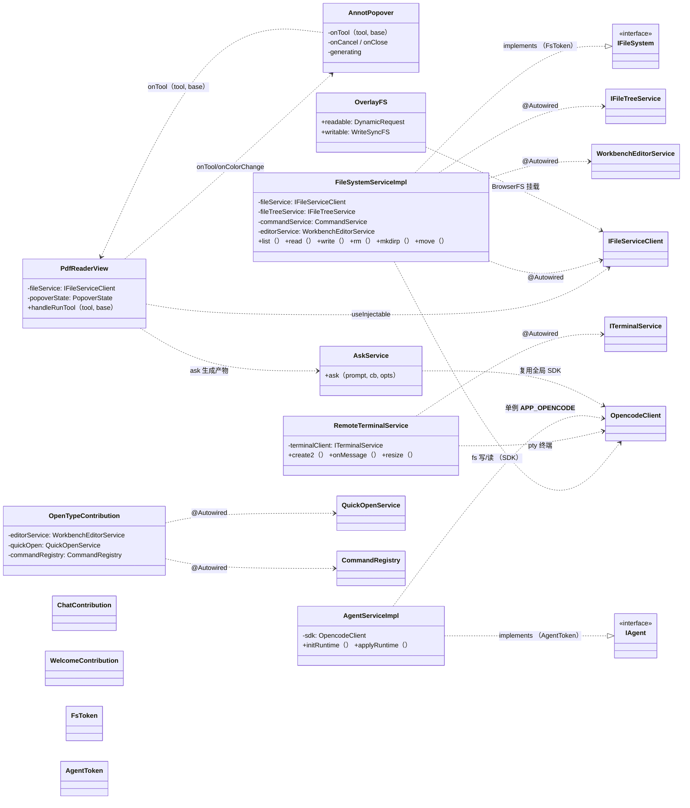
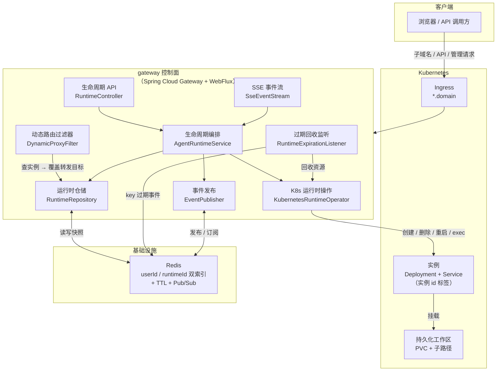
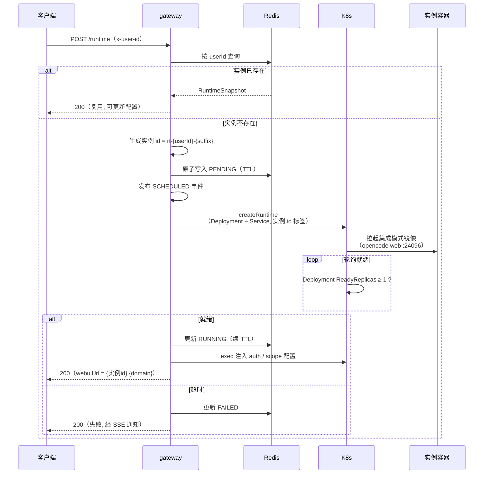
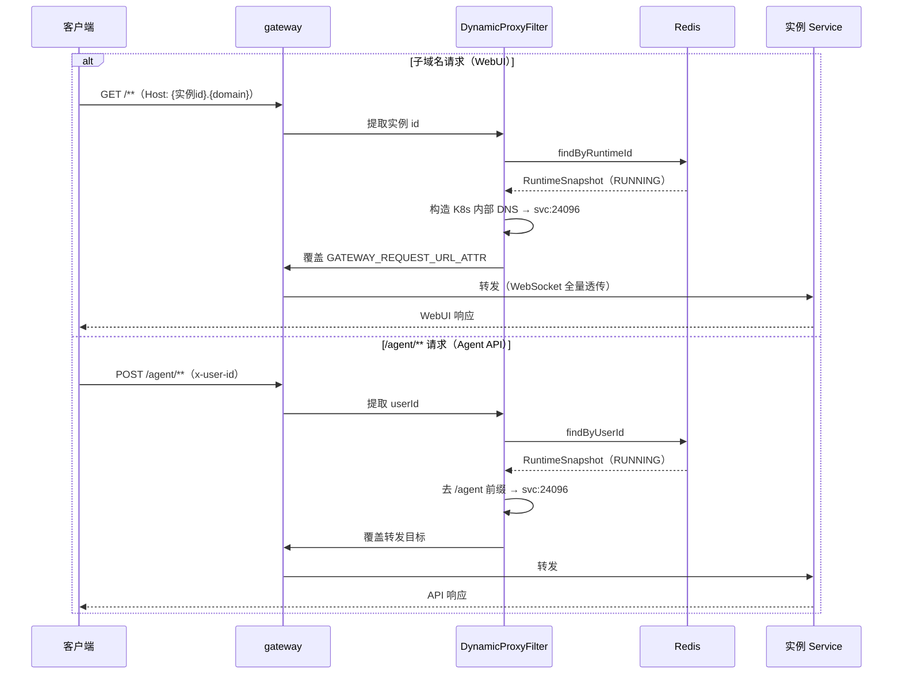
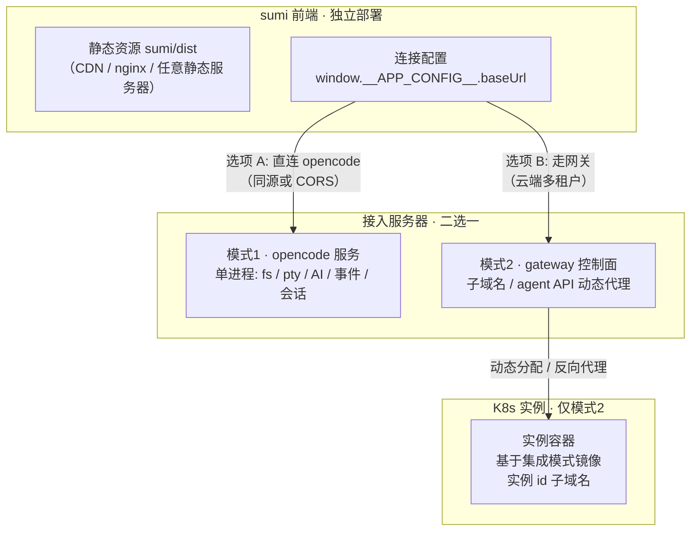

# Numas (🐮 牛马 AI) 总体架构设计

> 版本: v0.1 (2026-09)
> 适用: web 客户端 + opencode 后端集成
> 范围: 客户端架构与模块组织;与 opencode 的集成边界;三种部署形态

## 1. 概述

### 1.1 背景与目标

Numas (牛马们) 是一个面向"打工人"的 AI 辅助工作环境, 基于 codeblitz (OpenSumi) 构建浏览器端 IDE, 通过 opencode 提供 AI 对话、文件系统与终端能力。

本架构文档描述系统的分层模型、进程模型、依赖注入体系、类依赖关系、关键技术决策与三种部署形态 (集成模式 / 云原生模式 / 前后端分离模式)。

### 1.2 读者

- 参与 Numas 开发的工程师 (AI / 人类)
- 需要理解模块边界与依赖规则的后继维护者
- 部署与运维 (三种部署形态选型)

### 1.3 范围

- 客户端 (`sumi/src`) 的架构与模块组织
- 与 opencode 的集成边界
- 三种部署形态 (集成模式 / 云原生模式 / 前后端分离模式)
- 不包含: 具体业务交互设计 (见各功能设计与测试用例文档)


## 2. 集成模式 (默认开发形态)

> 单进程一体:sumi 客户端 (codeblitz 构建 UI) + opencode 服务端 (AI 对话 / 文件系统 / 终端 PTY / 事件 / 会话) 打包进同一进程,
> opencode 通过 `NUMAS_WEB_DIST` 内嵌托管 sumi 静态资源, `dev.js` 一键构建 + 启动, 默认端口 24096。

### 2.1 构建产物 (单进程一体)



| 阶段 | 命令 / 产物 | 说明 |
|---|---|---|
| sumi 构建 | `npm run build` → `sumi/dist` | codeblitz UI 静态资源 |
| 静态资源内嵌 | `dev.js` 增量 `mirror cp` | `sumi/dist` → `opencode/packages/app/dist`, 替代 `packages/app` build |
| opencode 构建 | `bun run script/build.ts --single --skip-install` | `NUMAS_WEB_DIST=sumi/dist` 直接内嵌 |
| 最终产物 | `dist/opencode-<os>-<arch>/bin/opencode` (~200MB) | 前端 + 服务端单进程, **模式 2 容器镜像的来源** |

### 2.2 架构总览



### 2.3 通信协议

| 用途 | 协议 | 入口 | 说明 |
|---|---|---|---|
| 文件读 | HTTP `GET /api/fs/read/<path>` | `service/fs.ts:840` | 走 codeblitz `IFileServiceClient` → opencode server fs API |
| 文件写 | HTTP `POST /api/fs/write` (base64) | `service/fs.ts:897` | 字节内容 base64 编码 (`groups/fs.ts:115-127`) |
| 文件删 / 建 / 移 | HTTP `/api/fs/remove` / `/mkdir` / `/rename` | `service/fs.ts` | 9 端点注册于 `groups/fs.ts:57-194` |
| 文件树事件 | SSE `EventSource /global/event` (V1) | `service/fs.ts:711-760` | 服务端 `@parcel/watcher` (200ms 防抖) → `file.watcher.updated` |
| 终端 PTY | WS `${baseUrl}/pty/{id}/connect?directory=...` | `service/terminal.ts:325` | 远程 spawn shell, `/pty/shells` 探测 |
| AI 对话 | SDK `@opencode-ai/sdk/v2/client` | `service/agent.ts:184` | header 自动带 `x-opencode-directory` |
| vsix 拓展 | `GET /metadata.json` (kt-ext 协议) | `service/registry` | `extensions/` 三套独立 vsix 源码, esbuild 自打包 |

### 2.4 通信分层铁律

```
外部  →  service  →  commands  →  codeblitz  →  extensions
```

- `extensions/` 读写文件: 必须走 codeblitz (`@opensumi/ide-file-service` 的 `IFileServiceClient`) → opencode server fs API (`/api/fs/*`)
- **严禁** extensions 直接调用 service 层 `__APP_FS__` / `service/fs.ts` 的任何方法
- service 层是 commands / codeblitz / 其他 service 调用的基础设施, 不暴露给 extensions 直调
- commands 层定义对外 API / token / interface, 是 service 与 codeblitz 之间的契约

### 2.5 进程模型与生命周期

- 入口 `dev.js` 单命令启动, 派生两个**独立 detached 进程组**:
  - `opencode serve` (HTTP+WS, 端口 24096): AI 对话 / 文件系统 / PTY 终端
  - `webpack dev-server` (端口 7788): 客户端静态资源与热更新
- 入口进程退出时整组终止 (SIGTERM → 进程组)
- 客户端运行时:
  ```
  index.tsx → App.tsx → createApp(codeblitz)
    ├─ config/app.ts      构建 __APP_CONFIG__ (cwd/defaultShell/workspaceDir)
    ├─ config/runtime.ts  runtimeConfig: OverlayFS 文件系统 + WORKSPACE_ROOT
    └─ config/modules.ts  getBuiltinModules → DI 容器注册全部模块

  启动后 (ClientAppContribution):
    AgentServiceImpl.initRuntime()  探测 hostCwd + 默认 shell, 注入配置, 派发 runtime-ready
    FileSystemServiceImpl.onStart() 启 watcher + 事件订阅 + explorer 刷新
    WelcomeContribution             空工作区自动打开欢迎页
  ```


## 3. 客户端分层模型

### 3.1 分层模型

系统采用**严格单向分层**, 内层不依赖外层:

```
┌─────────────────────────────────────────────────────────┐
│ extensions    UI / 交互组件 (PDF 标注 / Chat / 打开方式…)  │
├─────────────────────────────────────────────────────────┤
│ commands      API 契约层 (interface + token)             │
├─────────────────────────────────────────────────────────┤
│ service       基础设施层 (fs / agent / terminal / env)    │
├─────────────────────────────────────────────────────────┤
│ codeblitz     IDE 框架 (BrowserFS / 编辑器 / 布局)         │
│ opencode      AI / 文件 / PTY 后端服务                    │
└─────────────────────────────────────────────────────────┘
```

**依赖规则**:
1. `extensions` 仅通过 `commands` 契约或 codeblitz `IFileServiceClient` 访问能力, **禁止直连 service 内部实现**
2. `service` 只被 `commands` 与上层 `extensions` 通过注入接口使用
3. 所有对 opencode 的访问统一经全局 SDK 单例 (`__APP_OPENCODE__`)

### 3.2 依赖注入体系

基于 OpenSumi DI (`@opensumi/di`), 由 codeblitz `createApp` 初始化容器。

- **模块**: `BrowserModule` (声明 `providers` 与 `contributionProvider`), 在 `config/modules.ts#getBuiltinModules` 统一注册
- **服务/扩展**: 标 `@Injectable`; 依赖通过 `@Autowired(token)` 注入
- **浏览器组件**: 通过 `useInjectable(token)` 获取实例
- **生命周期**: 实现 `ClientAppContribution` / `BrowserEditorContribution` 等贡献点 (onStart / registerEditorComponent / registerCommands)

### 3.3 模块清单

| 类别 | 模块 | 说明 |
| --- | --- | --- |
| service | Agent / Registry / FileSystem / Terminal / Env | 基础设施 |
| 扩展 | Actions / Welcome / Chat / Workspace / FilePicker / PdfReader / Html / OpenType | 业务能力 |
| 框架 | TerminalNext / Task | OpenSumi 内置 |

### 3.4 全局单例

| 全局键 | 实例 | 职责 |
| --- | --- | --- |
| `__APP_FS__` | FileSystemServiceImpl | 文件系统统一入口 |
| `__APP_TERMINAL__` | RemoteTerminalService | 终端服务 |
| `__APP_AGENT__` | AgentServiceImpl | 运行时会话 |
| `__APP_OPENCODE__` | OpencodeClient (SDK) | opencode 访问唯一通道 |


## 4. 类依赖关系图



**关键依赖关系说明**:

| 依赖 | 方向 | 说明 |
| --- | --- | --- |
| 扩展 → commands | 接口实现 | 服务实现 `implements` 契约接口, 由 token 注入 |
| 扩展 → service | useInjectable / @Autowired | 经契约或容器获取能力 |
| service → codeblitz | @Autowired | IFileServiceClient / IFileTreeService / WorkbenchEditorService |
| service → opencode | SDK | 统一经 `__APP_OPENCODE__` 单例 |


## 5. 关键机制 (集成模式)

| 机制 | 实现 | 说明 |
|---|---|---|
| 进程一体化 | opencode fork 内嵌 sumi | `index.ts:47` `scriptName("numas")` 品牌; CSP 全开放 + 注入 `window.__APP_CONFIG__.registryBaseUrl` |
| 工作区路由 | per-request 路由 | `x-opencode-directory` header + `?directory=` query (`workspace-routing.ts:87`); CJK 需 `encodeURI` (header 必须 ISO-8859-1) |
| 文件树 watcher | 服务端 `@parcel/watcher` | 客户端零 watch 进程; mac=fs-events / linux=inotify / win=windows |
| vsix 注册 | registry @ 7790 | 内置 8 拓展内置实现; `html`/`paper`/`pdf` 三套 vsix 仅 dev 模式不加载 |
| 环境注入 | `window.__APP_CONFIG__` | 端口 / CORS / APP_BASE_URL 由 dev.js 控制, 透 process.env 注入, 单一事实源 |
| 平台兼容 | host 平台分流 | fs 命令按 mac/linux=POSIX、win=PowerShell 分流; shell 走 `/pty/shells` 探测 |
| 端口 | 24096 (默认) | `--port <n>` / `NUMAS_PORT` 改; `--registry <url>` / `NUMAS_REGISTRY` (默认 http://127.0.0.1:7790) |

> **模式 1 → 模式 2**: 本模式的单进程构建产物直接打包为容器镜像 (见 §6), 仅需以 `--hostname 0.0.0.0 --cors *` 无头启动即可被 gateway 调度。


## 6. 云原生模式 (基于集成模式 + gateway 控制面)

> 在集成模式之上增加 **gateway 控制面** (Spring Cloud Gateway + WebFlux 反应式 + Fabric8 K8s 客户端):
> 根据请求**动态分配容器实例** (镜像基于集成模式构建, `deploy → svc → 实例 id`), 并以**实例 id 作为子域名**提供反向代理。
> 参考实现: `agent-gateway` (Spring Cloud Gateway + Redis 双索引 + TTL 租约回收 + SSE 事件流)。

### 6.1 镜像 (基于集成模式构建)

集成模式的构建产物 (sumi 客户端 + opencode 服务端, 单进程一体) 直接打包为容器镜像:

| 项 | 说明 |
|---|---|
| 来源 | 集成模式构建产物 (`sumi/dist` 静态资源 + opencode 服务端单进程) |
| 启动命令 | `opencode web --hostname 0.0.0.0 --port 24096 --cors *` (无头模式, 不自动开浏览器) |
| 容器端口 | `24096`: WebUI 与 Agent API 同端口 (网关抽象出 webui / agent 两个转发端口, 均指向该容器端口, 可配置) |
| 工作区 | `/app`, PVC 子路径持久化 (全局共享配置 + `{userId}` 用户数据 + 运行时工作区) |

### 6.2 架构总览



### 6.3 实例生命周期 (deploy → svc → 实例 id)



### 6.4 动态路由反向代理 (实例 id 子域名)



### 6.5 关键机制

| 机制 | 实现 | 说明 |
|---|---|---|
| 实例寻址 | Redis 双索引 | `{prefix}:user:{userId}` → 快照; `{prefix}:runtimeId:{id}` → userId, O(1) 查询 |
| 动态分配 | K8s Fabric8 | 按 userId 判断, 无实例则 `deploy → svc`, 实例 id 作标签与子域名 |
| 反向代理 | DynamicProxyFilter | 子域名 → WebUI 端口; `/agent/**` → Agent API 端口; WebSocket 透传 |
| 租约回收 | Redis TTL + 过期监听 | key 到期触发 `__keyevent__:expired` → 删除 Deployment + Service |
| 状态推送 | SSE + Redis Pub/Sub | 事件流 + 30s 心跳 + 300s 续约 |
| 配置注入 | K8s exec | 认证信息写入容器, 子域名访问自动带 Cookie |
| 持久化 | PVC 子路径 | 全局共享配置 + `{userId}` 数据 + 运行时工作区 |


## 7. 前后端分离模式

> sumi 前端**单独部署** (静态资源, 任意托管), 通过**可配置接入服务器地址** (`window.__APP_CONFIG__.baseUrl`) 连接后端:
> 接入服务器二选一——**模式 1 的 opencode 服务**, 或**模式 2 的 gateway**。前端与后端协议不变, 能力不变。

### 7.1 架构总览



### 7.2 连接协议 (与集成模式一致)

sumi service 层通过 `baseUrl` 指向接入服务器, 通信协议与集成模式完全一致:

| 能力 | 协议 | 路径 |
|---|---|---|
| 文件系统 | HTTP | `/api/fs/*` |
| 终端 PTY | WebSocket | `/pty/*` |
| AI 对话 | SDK (HTTP) | `/v2/*` |
| 事件 | EventSource (SSE) | `/global/event` |
| 工作目录 | Header | `x-opencode-directory` (CJK 需 `encodeURI`) |

### 7.3 接入方式选型

| 接入方式 | baseUrl | 适用场景 | 说明 |
|---|---|---|---|
| 模式 1 · 直连 opencode | `http://<opencode-host>:24096` | 少量 / 可信用户, 部署简单 | opencode 服务以 `--hostname 0.0.0.0 --cors *` 起, per-request 工作区路由 (`x-opencode-directory`) |
| 模式 2 · 走 gateway | `http://{userId}.{domain}` (子域名) 或 `http://{domain}/agent` | 多用户隔离 / 云端交付 | gateway 动态分配实例并按需回收, sumi 通过子域名绑定到自己的实例 |

> **同源部署**: 前端静态资源可由接入服务器 (opencode / gateway) 同域托管, 规避 CORS; **跨域部署**则开启 `--cors *` 并放行预检请求。
> **与集成模式的关系**: 集成模式 = 前后端同进程打包; 前后端分离模式 = 将同一份 sumi 前端拆出独立部署, 后端复用模式 1 或模式 2 的接入能力。


## 8. 关键技术决策

| # | 决策 | 理由 |
| --- | --- | --- |
| 1 | 砍中间层, 客户端直连 opencode | 中间层 HTTP 反代导致写文件 409 死锁 + 终端 ws 卡死 + CORS 散落 |
| 2 | 文件写经 FsPty 单例, 读走 SDK | 写操作不受 session 单 shell 限制 (409); 读走全局 API |
| 3 | 文件系统 OverlayFS = DynamicRequest + WriteSyncFS | 读实时直连宿主机, 写 InMemory + 同步服务器, 断循环 (hash 比对) |
| 4 | 宿主机同步用 watchexec | opencode pty 内 FSEvents 对 node 全废 (EMFILE), watchexec (Rust) 全事件正常 |
| 5 | WORKSPACE_ROOT 运行时取真实 cwd | `file:///workspace` 虚拟根 → `file:///{cwd}`, 与宿主机/opencode 三层路径一致 |
| 6 | 大文件移动经宿主机原子 mv | codeblitz fse.move (copy+remove) 会损坏 30MB+ 文件 |
| 7 | 端口 / APP_BASE_URL 单一事实源 | cli 注入 process.env → webpack DefinePlugin, 避免散落 |
| 8 | 中文路径 encodeURI | HTTP header 需 ISO-8859-1 |


## 9. 术语表

| 术语 | 说明 |
| --- | --- |
| codeblitz | 基于 OpenSumi 的浏览器 IDE 框架 (`@codeblitzjs/ide-core`) |
| opencode | AI 后端服务 (对话 / 文件 / PTY / 事件) |
| BrowserFS | 浏览器内存文件系统 |
| OverlayFS | 可读层 + 可写层合并文件系统 |
| FsPty | 文件系统写操作专用 PTY 单例 |
| WRITEFS | WriteSyncFS: 写侧 InMemory + 同步服务器 |
| WORKSPACE_ROOT | codeblitz 工作区根 (运行时=真实 cwd) |
| runtime-ready | 运行时初始化完成事件 |
| PTY | 伪终端 (opencode 远程 spawn shell) |
| 反代 (`/proxy/<port>/`) | opencode 已知端口 HTTP/WS 反代, 仅白名单 + 跟踪 PIDs 才允许, 防 SSRF |
| gateway | 云原生模式下的 Spring Cloud Gateway 控制面 |
| 实例 id | 云原生模式下动态分配容器的唯一标识, 同时作为子域名 |
| Fabric8 | K8s Java 客户端, gateway 用作 RuntimeOperator |
| DynamicProxyFilter | gateway 动态路由过滤器, 子域名 → 实例 Service |