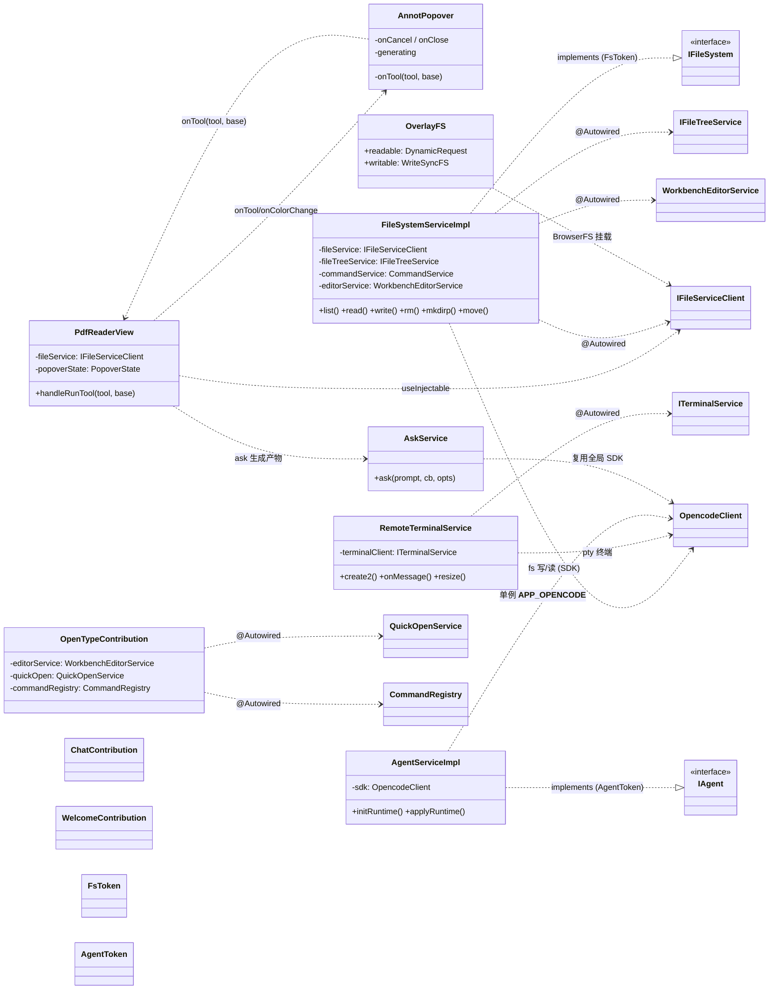

# Numas 架构设计

> 版本: v0.1 (2026-09-01)
> 适用: web/ 客户端 + opencode 后端集成

## 1. 概述

### 1.1 背景与目标

Numas (牛马们) 是一个面向"打工人"的 AI 辅助工作环境, 基于 codeblitz (OpenSumi) 构建浏览器端 IDE, 通过 opencode 提供 AI 对话、文件系统与终端能力。

本架构文档描述系统的分层模型、进程模型、依赖注入体系、类依赖关系及关键技术决策。

### 1.2 读者

- 参与 Numas 开发的工程师 (AI / 人类)
- 需要理解模块边界与依赖规则的后继维护者

### 1.3 范围

- 客户端 (web/) 的架构与模块组织
- 与 opencode 的集成边界
- 不包含: 具体业务交互设计 (见功能清单)

## 2. 总体架构

### 2.1 分层模型

系统采用**严格单向分层**, 内层不依赖外层:

```
┌─────────────────────────────────────────────────────────┐
│ extensions    UI / 交互组件 (PDF 标注 / Chat / 打开方式…)  │
├─────────────────────────────────────────────────────────┤
│ commands      API 契约层 (interface + token)             │
├─────────────────────────────────────────────────────────┤
│ service       基础设施层 (fs / agent / terminal / env)    │
├─────────────────────────────────────────────────────────┤
│ codeblitz     IDE 框架 (BrowserFS / 编辑器 / 布局)         │
│ opencode      AI / 文件 / PTY 后端服务                    │
└─────────────────────────────────────────────────────────┘
```

**依赖规则**:
1. `extensions` 仅通过 `commands` 契约或 codeblitz `IFileServiceClient` 访问能力, **禁止直连 service 内部实现**
2. `service` 只被 `commands` 与上层 `extensions` 通过注入接口使用
3. 所有对 opencode 的访问统一经全局 SDK 单例 (`__APP_OPENCODE__`)

### 2.2 进程模型

- 入口 `dev.js` 单命令启动, 派生两个**独立 detached 进程组**:
  - `opencode serve` (HTTP+WS, 端口 24096): AI 对话 / 文件系统 / PTY 终端
  - `webpack dev-server` (端口 7788): 客户端静态资源与热更新
- 入口进程退出时整组终止 (SIGTERM → 进程组)

### 2.3 部署形态

- 客户端为**纯前端** (webpack 产物), 可静态托管 (nginx)
- 运行时唯一硬依赖为 opencode 服务 (需 `--cors *` 支持浏览器跨域)

## 3. 依赖注入体系

### 3.1 DI 容器

基于 OpenSumi DI (`@opensumi/di`), 由 codeblitz `createApp` 初始化容器。

- **模块**: `BrowserModule` (声明 `providers` 与 `contributionProvider`), 在 `config/modules.ts#getBuiltinModules` 统一注册
- **服务/扩展**: 标 `@Injectable`; 依赖通过 `@Autowired(token)` 注入
- **浏览器组件**: 通过 `useInjectable(token)` 获取实例
- **生命周期**: 实现 `ClientAppContribution` / `BrowserEditorContribution` 等贡献点 (onStart / registerEditorComponent / registerCommands)

### 3.2 模块清单

| 类别 | 模块 | 说明 |
| --- | --- | --- |
| service | Agent / Registry / FileSystem / Terminal / Env | 基础设施 |
| 扩展 | Actions / Welcome / Chat / Workspace / FilePicker / PdfReader / Html / OpenType | 业务能力 |
| 框架 | TerminalNext / Task | OpenSumi 内置 |

### 3.3 全局单例

| 全局键 | 实例 | 职责 |
| --- | --- | --- |
| `__APP_FS__` | FileSystemServiceImpl | 文件系统统一入口 |
| `__APP_TERMINAL__` | RemoteTerminalService | 终端服务 |
| `__APP_AGENT__` | AgentServiceImpl | 运行时会话 |
| `__APP_OPENCODE__` | OpencodeClient (SDK) | opencode 访问唯一通道 |

## 4. 类依赖关系图

### 4.1 mermaid classDiagram



### 4.2 关键依赖关系说明

| 依赖 | 方向 | 说明 |
| --- | --- | --- |
| 扩展 → commands | 接口实现 | 服务实现 `implements` 契约接口, 由 token 注入 |
| 扩展 → service | useInjectable / @Autowired | 经契约或容器获取能力 |
| service → codeblitz | @Autowired | IFileServiceClient / IFileTreeService / WorkbenchEditorService |
| service → opencode | SDK | 统一经 `__APP_OPENCODE__` 单例 |

## 5. 启动流程

```
index.tsx → App.tsx → createApp(codeblitz)
  ├─ config/app.ts      构建 __APP_CONFIG__ (cwd/defaultShell/workspaceDir)
  ├─ config/runtime.ts  runtimeConfig: OverlayFS 文件系统 + WORKSPACE_ROOT
  └─ config/modules.ts  getBuiltinModules → DI 容器注册全部模块

启动后 (ClientAppContribution):
  AgentServiceImpl.initRuntime()  探测 hostCwd + 默认 shell, 注入配置, 派发 runtime-ready
  FileSystemServiceImpl.onStart() 启 watcher (watchexec) + 事件订阅 + explorer 刷新
  WelcomeContribution             空工作区自动打开欢迎页
```

## 6. 关键技术决策

| # | 决策 | 理由 |
| --- | --- | --- |
| 1 | 砍中间层, 客户端直连 opencode | 中间层 HTTP 反代导致写文件 409 死锁 + 终端 ws 卡死 + CORS 散落 |
| 2 | 文件写经 FsPty 单例, 读走 SDK | 写操作不受 session 单 shell 限制 (409); 读走全局 API |
| 3 | 文件系统 OverlayFS = DynamicRequest + WriteSyncFS | 读实时直连宿主机, 写 InMemory + 同步服务器, 断循环 (hash 比对) |
| 4 | 宿主机同步用 watchexec | opencode pty 内 FSEvents 对 node 全废 (EMFILE), watchexec (Rust) 全事件正常 |
| 5 | WORKSPACE_ROOT 运行时取真实 cwd | file:///workspace 虚拟根 → file:///{cwd}, 与宿主机/opencode 三层路径一致 |
| 6 | 大文件移动经宿主机原子 mv | codeblitz fse.move (copy+remove) 会损坏 30MB+ 文件 |
| 7 | 端口/APP_BASE_URL 单一事实源 | cli 注入 process.env → webpack DefinePlugin, 避免散落 |
| 8 | 中文路径 encodeURI | HTTP header 需 ISO-8859-1 |

## 7. 术语表

| 术语 | 说明 |
| --- | --- |
| codeblitz | 基于 OpenSumi 的浏览器 IDE 框架 (@codeblitzjs/ide-core) |
| opencode | AI 后端服务 (对话/文件/PTY/事件) |
| BrowserFS | 浏览器内存文件系统 |
| OverlayFS | 可读层 + 可写层合并文件系统 |
| FsPty | 文件系统写操作专用 PTY 单例 |
| WRITEFS | WriteSyncFS: 写侧 InMemory + 同步服务器 |
| WORKSPACE_ROOT | codeblitz 工作区根 (运行时=真实 cwd) |
| runtime-ready | 运行时初始化完成事件 |
