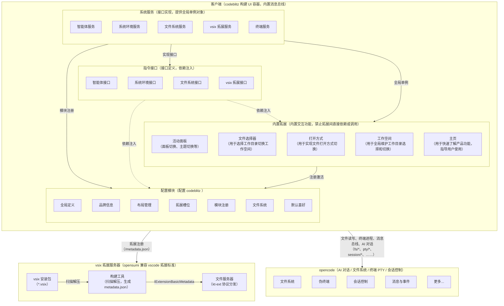

# Numas（🐮 牛马 AI）

## 1. 集成模式

```mermaid
graph TD

    subgraph sumi[客户端（codeblitz 构建 UI 容器，内置消息总线）]
        direction TB
        subgraph config[配置模块（配置 codeblitz ）]
            direction TB
            app[全局定义]
            brand[品牌信息]
            layout[布局管理]
            slots[拓展槽位]
            modules[模块注册]
            runtime[文件系统]
            preferences[默认喜好]
        end

        subgraph commands[指令接口（接口定义，依赖注入）]
            direction TB
            iagent[智能体接口]
            ienv[系统环境接口]
            ifs[文件系统接口]
            iregistry[vsix 拓展接口]
        end

        subgraph service[系统服务（接口实现，提供全局单例对象）]
            direction TB
            agent[智能体服务]
            env[系统环境服务]
            fs[文件系统服务]
            registry[vsix 拓展服务]
            terminal[终端服务]
        end

        subgraph extensions[内置拓展（内置交互功能，禁止拓展间直接依赖或调用）]
            direction TB
            actions[活动面板<br/>（面板切换、主题切换等）]
            filepicker[文件选择器<br/>（用于选择工作目录切换工作空间）]
            opentype[打开方式<br/>（用于实现文件打开方式切换）]
            workspace[工作空间<br/>（用于全局维护工作目录选择和切换）]
            welcome[主页<br/>（用于快速了解产品功能，指导用户使用）]
        end

        service --> |实现接口|commands
        service --> |模块注册|config
        commands -.->|依赖注入|extensions
        commands -..-> |依赖注入| config
        extensions -->|注册激活| config
        service --> |全局单例|extensions
    end

    subgraph opencode[opencode（AI 对话 / 文件系统 / 终端 PTY / 会话控制）]
        direction TB
        fss[文件系统]
        pty[伪终端]
        seesion[会话控制]
        event[消息与事件]
        more[更多...]
    end

    subgraph rg[vsix 拓展服务器（opensumi 兼容 vscode 拓展标准）]
        direction LR
        rgvsx[vsix 安装包<br/>（*.vsix）]
        rgb[构建工具<br/>（扫描解压，生成 metadata.json）]
        rgs[文件服务器<br/>（kt-ext 协议分发）]
        rgvsx --> |扫描解压| rgb --> |IExtensionBasicMetadata| rgs
    end

    sumi --> |拓展注册<br/>（/metadata.json）|rg
    sumi --> |文件读写、终端进程、消息总线、AI 对话<br/>（fs/*、pty/*、session/*、……）| opencode
```
